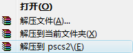
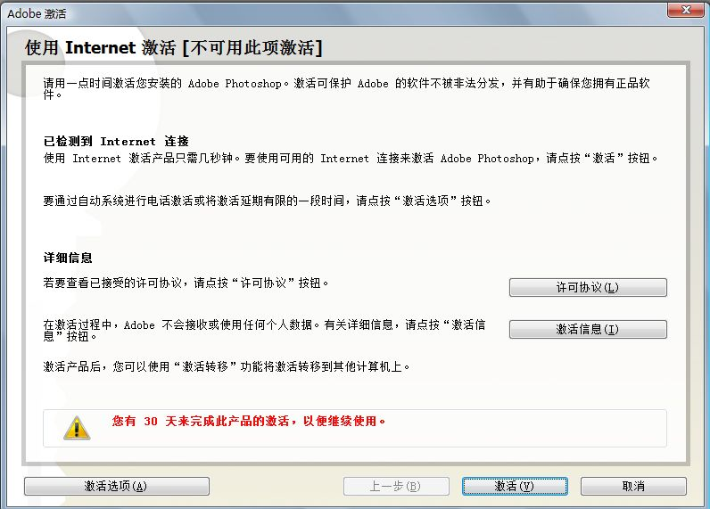
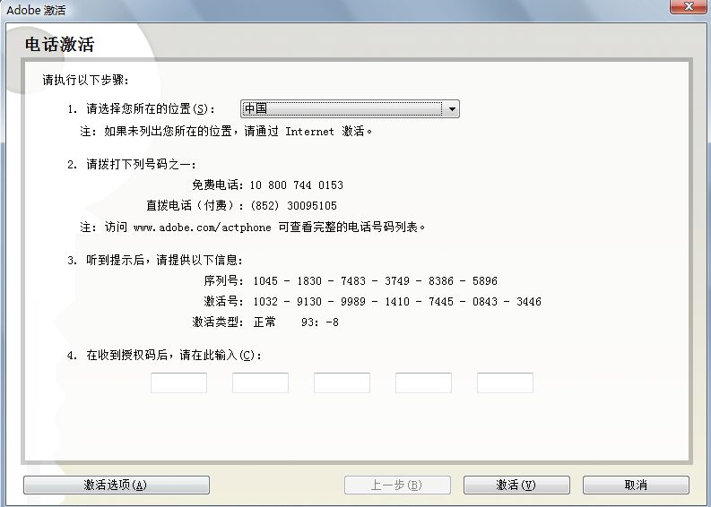
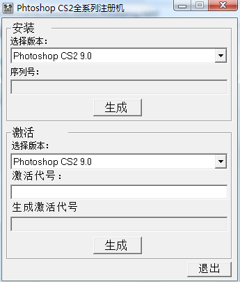
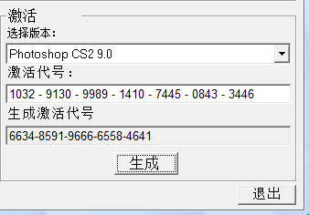
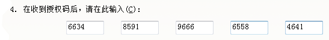
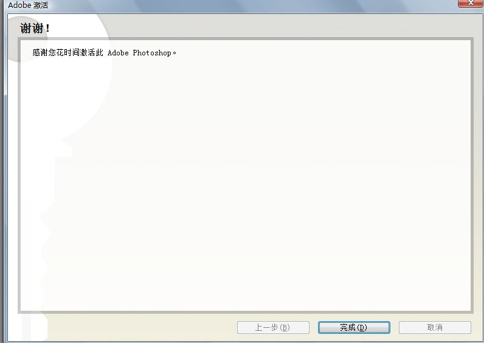

# photoshop绿色版 

> 2007-09-15

 呵呵，今天用photoshop cs9作图，告诉大家绿色下载地址吧，供网吧的网友使用。
  
 
  
 ===================================说明==============================
  
 呵呵，下载后
  
  
 
 右键
 
 选择如图所示
  
 出现一个名为pscs2的文件夹
  
 然后打开这个文件夹，然后打开
 
 ，
  
 等会，然后打开
 
 。。。出现
 
 呵呵，点激活，然后提示错误，别管他，点电话激活
 
 复制
 
 这回在打开文件夹里的 注-册-机.exe（
 
 ）
  
 
  
 然后把
 
 输入到激活代码里点生成
 
  
 ok，再把6634-8591-9666-6558-4641抄下来，然后依次输进去
 
 点激活ok大功告成，激活成功
 

