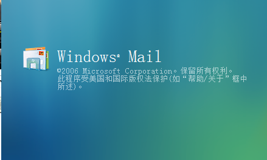
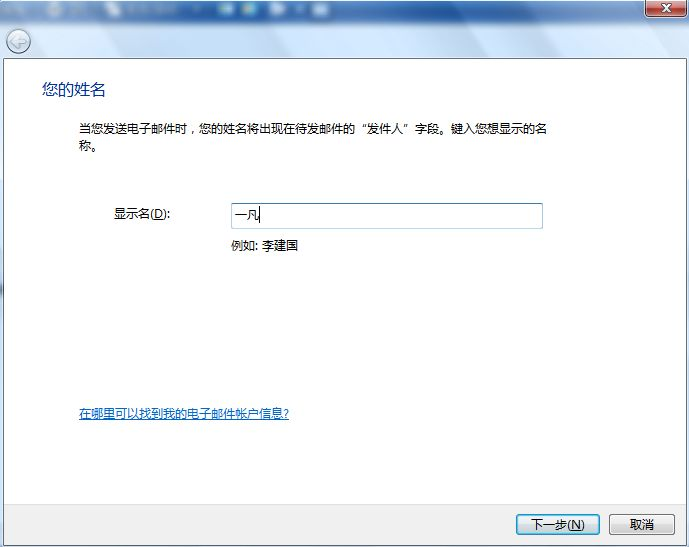
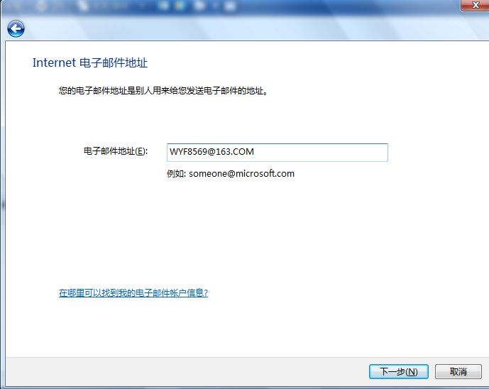
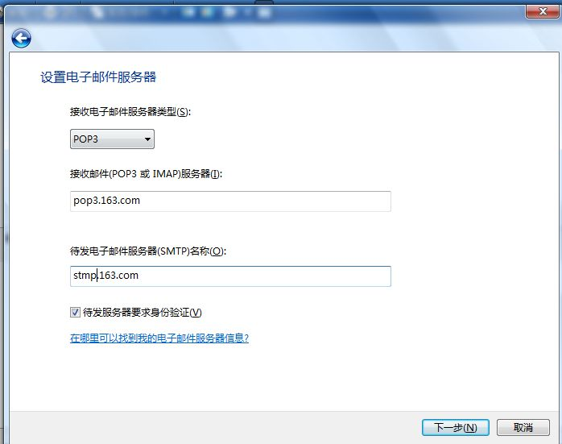
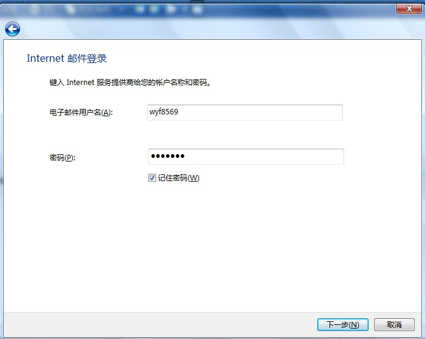
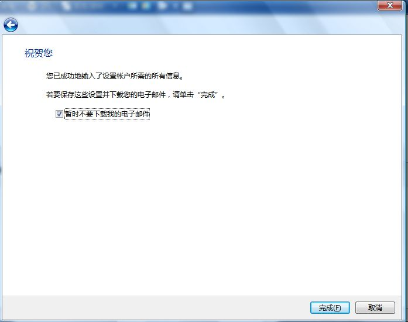
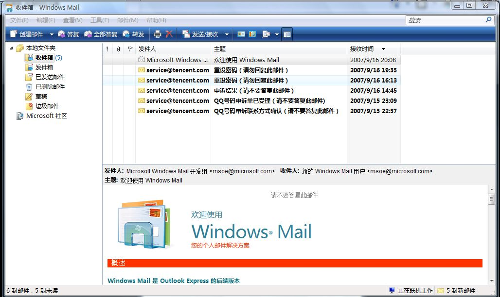

# 【本站】windows vista mail配置 

> 2007-09-16

 

  【vista】
 

 

  呵呵，windows mail其实就是xp的Explorers outlook，配置大同小异。
  
 

 

  开始-所有程序-Windwos mail
 

 
 第一次运行有向导
 
 继续
 
 下面的按自己邮箱配置（pop3：pop3.邮箱服务商.com）(stmp：stmp.邮箱服务商.com)
 
 
 
 
 成功

