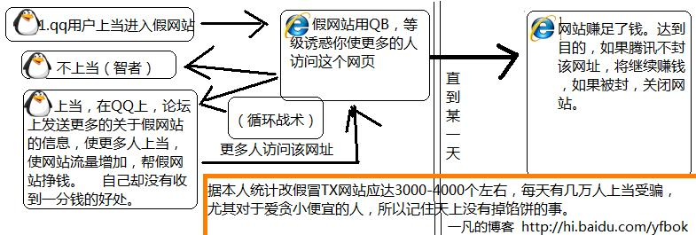

# [本站解析]QQ 币免费得？告诉你：这个网站是个骗子！ 天上没有掉馅饼的事 

> 2007-09-23

 
 

  引子：
 

 

  某人QQ：快帮我点一下 www.某某qq.com/index.asp?23422
 

 

  我说：哎~~~
 

 

  某人QQ：哎什么，到底点了没有？我想要那个23422qq
 

 

  我说：我对你无话可说
 

 

  某人QQ：算了，不点就不点有什么了不起的
 

 

  我说：你上当了！！！
 

 

  某人QQ：啊？不会的！
 

 

  我说：咱们还是别聊了吧
 

 

  最近总是有些人在群里发来发去：
 

 

  发送什么什么网页，得多少qb或者3个群1个月亮，6个群1个太阳等的
 

 

  <strong>
   例如
  </strong>
   
  <a href="http://hi.baidu.com/huanlezsong?4880">
   <strong>
    http://hi.baidu.com/huanlezsong?4880
   </strong>
  </a>
  （大家不要点了）
   
  <strong>
   好消息啦！好消息啦！腾迅庆贺周年特别开放QQ欢乐送，6位QQ号免费申请，Q币免费赠送，现在开始免费送QQ币啦!每个QQ用户都可进入领取哦
  </strong>
 

 

  我虽然不是专家，也不是教授，但是这个小骗局我还是清楚的。这些都是假的，都是一些人为了提高自己网站的流量从而某小利而发布的一些虚假广告，主要是利用了人们的贪小便宜的心里，正所谓一传百百传千的道理，我晕，我的qq后面有8个群在发这个广告，吵都吵死了，天上没有掉馅饼的日子，如果正如上述所说的话，那么腾讯还赚什么呢？
 

 

  再来看看它的地址
  <a href="http://222.186.127.131/">
   http://222.186.127.131/
  </a>
  (这个网站思路厉害，有两个赚钱思路，一、盗取你的qq 二、利用人们贪小便宜的心里帮他们刷流量放广告挣钱)
 

 

  一看就不是qq.com为后缀的地址，明显是某人自己架设的服务器，什么时候关闭都有可能。
 

 

  发送几个ip只是在骗你，网站里面说什么号已送出那都是乱编的，一般的爱占小便宜的人会上当，而切上当率很高，我恨死那些编这些网站的卑鄙小人了，不过也太绝了，年年都有。。。而且假如很多人访问他们那个所谓的送qqb送号送太阳的网站，他们就会赚钱，因为有广告。在一个不起眼的地方，只要稍稍留意一下，这样他们差不多1个月赚1万快左右。非法营利啊。
 

 

  <strong>
   这从不严格的意义上来讲就是传销！！！
  </strong>
 

 

  首先宣传网页，然后让人上当以为是自己在赚钱是个商机，发展下线，一传百百传千，最后每个人都拿不到利润，网站关闭！！
 

 

  如果还不懂的话我做了个图
 

 
 

  循环示意图，一凡构思
 

 

 

 

 

 

 

