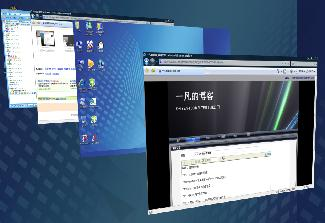

# vista使用的快捷键 

> 2007-09-23

 
 

  呵呵，偶然发现的
 

 

  Win+Tab(aero 3d 窗口切换)
 

 

  Ctrl+Win+Tab（不用按着win的aero 3d窗口切换）
 

 

  Ctrl+Shift+Esc(任务启动管理器)
 

 

  Ctrl+Alt+Del(用户操作界面)
 

 

  Ctrl+NUM1，NUM2……（启动快速启动栏的程序）
 

 

  还有很多只是我没发现
 

