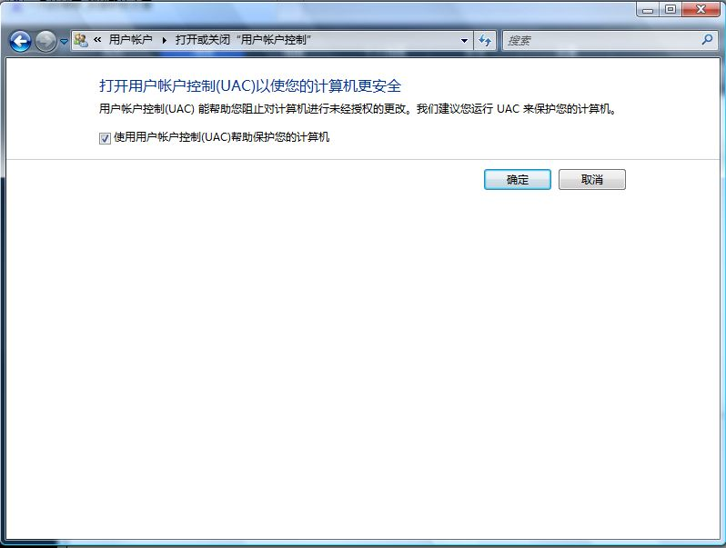

# xp永远比不上vista 

> 2007-10-01

 

  我认为：xp再怎么仿vista也是xp内核，不稳定
 

 

  vista的UAC以前我认为是个没有的东西，今天才知道，有了大用
  
 

 

  我经过测试，下载了个熊猫烧香
 

 

  打开UAC，然后打开熊猫烧香，竟然被vista强行终止了
 

 

  这个是xp没有的
 

 

  现在佩服微软的技术啦，什么病毒一般都会防，它没有病毒库，不知道怎么弄的
 

