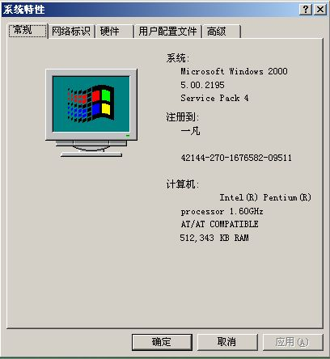

# 今天做了个双系统 

> 2007-10-01

 

  WINDOWS 2000+xp再带vista
 

 
 

  2000速度感觉速度比xp快多了，xp速度比vista快多了，vista的速度比蜗牛快多了
 

 

  汗
 

 

  vista的界面比xp华丽多了，xp的界面比2000华丽多了，2000的界面比dos华丽多了
 

 

  2000装得可累死我了，因为我只有sp1的，下载sp4的补丁很长时间再加上安装零散补丁，我快晕了
 

 

  强烈建议微软发布sp5补丁啊
 

