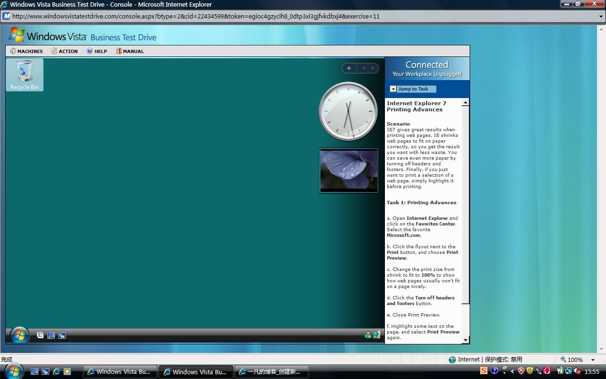
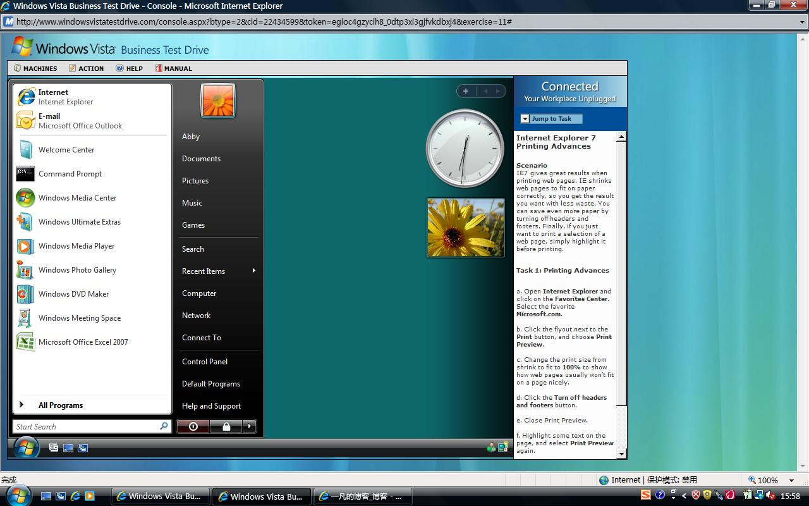
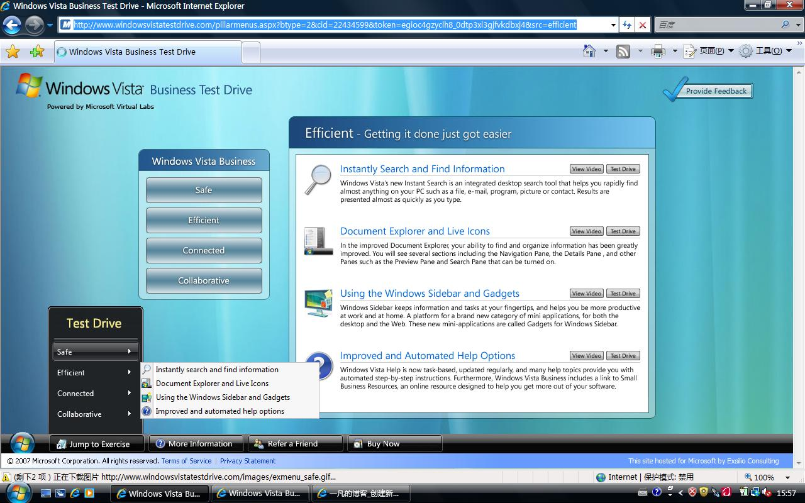

# 网页上的windows vista 

> 2007-10-05

 

  挺有意思的
 

 
 
 微软的网页，让网友体验vista要安装控件的，仿的真的挺像的
 <strong>
  网站
 </strong>
 <a href="http://www.windowsvistatestdrive.com/">
  http://www.windowsvistatestdrive.com/
 </a>
 
 有点卡，英文不怎么看得懂。大家乱点吧

