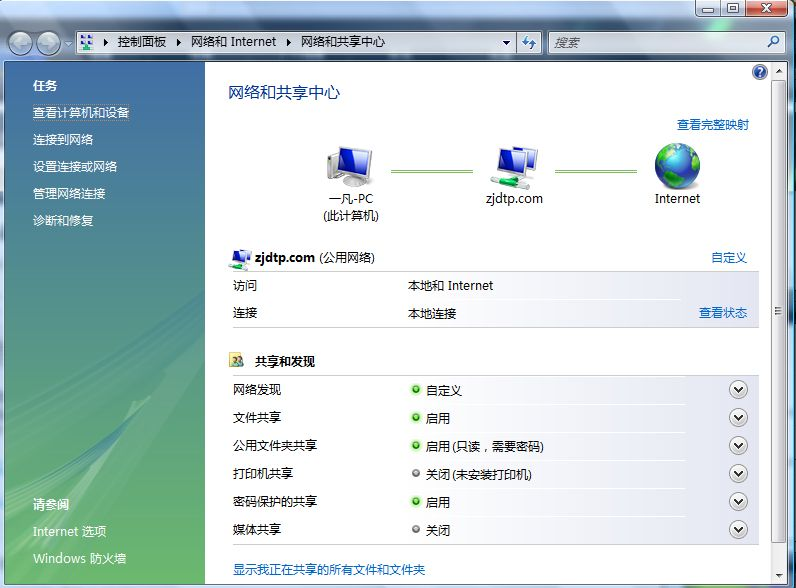

# 最近ip被网管封了 

> 2007-10-08

 呵呵，最近网速比较慢，所以呢？我想出了一个发子---控制别人的网速，所以我就下载了一个P2P软件，聚生网管。
 

  我把全网的网络给断了，那时候，网速超级的快，好事不长，马上被网管发现了，封了我的ip，导致了我好几天都上不了网
 

 今天我给他打了个电话，他说我的电脑中毒了，我晕，让我查毒，过了三十分钟。我告诉他没毒，他奇怪+疑惑，哈哈。后来，他就说现在应该可以上了，我发现vista的网络连接变成了已经连接到了internet，哈哈管他三七二十一，他爱怎么想怎么想，反正他也不懂什么是聚生网管。他只知道有病毒会进行arp攻击，却不知道有软件。o(∩_∩)o...哈哈，能上网了，太高兴了
 

