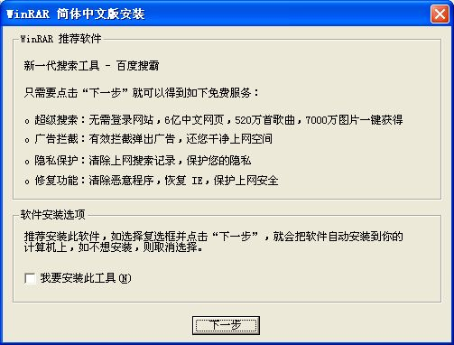

# 防不胜防 

> 2007-10-20

 
 

  今天系统重新安装了1下，以前的系统太乱了，所以我格式化了，我安装了深度精简的deepinV5的xp
 

 

  因为------快
 

 

  安装后，我再安装常用软件，发现，现在的著名软件一般都捆绑了插件，就连著名的Winrar也是一样，刚刚出来，哎~~~~
 

 
 如果你不小心按了1下的话，那么你的系统速度就会便慢，最近给别人修过的计算机，98%的计算机都是带插件或垃圾软件的，我晕，现在的人们只会按下一步下一步，大家应该从细节防范垃圾软件，从而不中病毒！最后说一句 深度的精简xp的速度真快！好！

