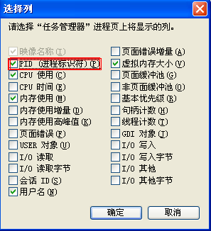

# 破解极域电子教室（有补充） 

> 2007-10-23

 
 

  假若你在学校里，老师的计算机利用极域电子教室服务器端的话，那么你的电脑就会受限，随时要被老师所控制。我最近研究出如何逃脱老师的手掌心了
  
  。呵呵，仅供参考。一凡原创，若有雷同纯属巧合。
 

 

 

 

  <strong>
   
   1.断网法
  </strong>
  安全率 ★★★★☆（80%） 难度 ★★☆☆☆（40%）
 

 

  呵呵，把网络断了，也就是说：
 

 

  开机-网上邻居-右键-属性-本地连接（当时上网的连接）-右键-禁用
 

 

  这样你就不能上网了，可是这不是等于没说吗？别急，然后你再等到其他人被老师所控制时，你再
 

 

  本地连接-右键-启用
 

 

  这样，你的电脑就会不受老师控制了，既可以上网，又可以不被老师控制
 

 

  经本人测试：再重新启动也不会被老师控制
 

 

  <strong>
   
   2.不开机法
  </strong>
  安全率 ★☆☆☆☆（20%） 难度 ☆☆☆☆☆ （0%）
 

 

  这个很简单，先不开机，等到别人被控制时，再开机，那样你就可以和上面的一样不被控制了，相比下这个比较简单，但是可行度很低。
 

 

 

 

  其实以上2点都是利用了极域电子教室的漏洞：不会自动发现主机，假若网络突然断了，会提示极域电子教室的TCP协议错误，从而造成不会被控制
 

 

  <strong>
   ====================================
  </strong>
 

 

  另外，
  <strong>
   按下Ctrl+Q可以让被控制的全屏窗口退到窗口化，呵呵，这个最安全
  </strong>
 

 

  <strong>
   Pause Break是举手，呵呵这个我第一个按的，后来一传十，十传百。集体按举手。
  </strong>
 

 

  <strong>
   ===================================
  </strong>
 

 

  
  新思路
 

 

  呵呵，这个可以彻底的攻破极域电子教室，即结束它
 

 

  我们知道任务管理器是的进程中的StudentEX.exe是结束不掉的，因为被老师监控者
 

 

  所以我们可以利用系统的pid来结束它，因为每个电脑的pid都不同所以
 

 

  任务管理器-查看-选择列-PID勾上，然后你再查看StudentEX.exe的pid，记住，例如1952什么的
 

 
 

  然后开始菜单-运行-ntsd - c q-p PID
 

 

  这里的PID指那个编号
 

 

 

 呵呵，然后经过一个dos命令闪过，你就可以看到极域电子教室不击而退了，这个是最厉害的挣脱老师的束缚，完全看不到极域电子教室的踪影了。其实这个我也没试过，只是思路而已
 <strong>
  ===================================
 </strong>
 <strong>
  呵呵，仅供研究，本人不承担任何法律责任，后果自负。
 </strong>

