# 玩玩linux系统 [图] 

> 2007-10-27

 

 

 
 

  linux早都想玩，可惜vista的推出打断了我的计划，现在vista已经算是研究透彻了，我正式自学linux了！
 

 

  首先我从网上下载了个 共创Linux2005 （OpenDesktop 2005）下载了1个小时（因为网速限制200k）
 

 

  然后我用微软的虚拟机安装
 

 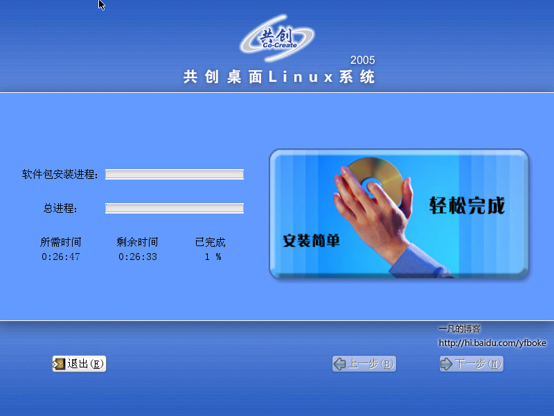
 安装中...
 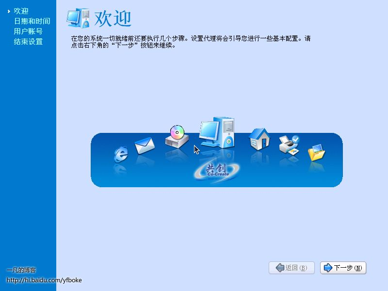
 安装好后进入配置页面
 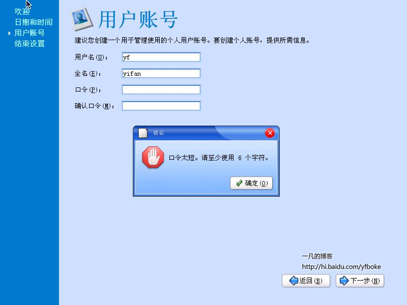
 呵呵，必须输入密码，linux的密码限制很严格的，比xp强
 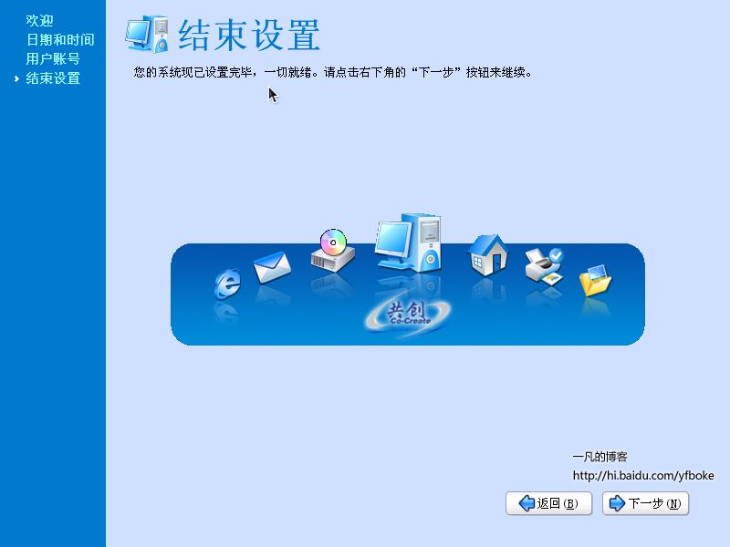
 配置好了
 
 开机启动画面
 
 登录画面 类似于xp
 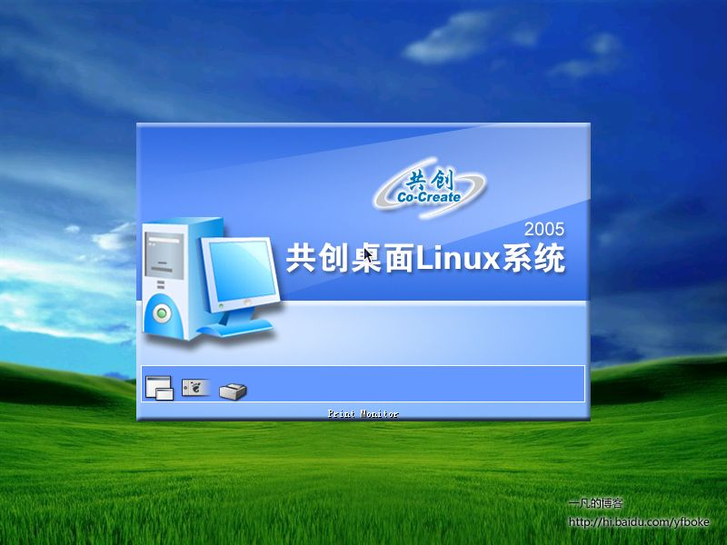
 继承传统linux的启动程序画面
 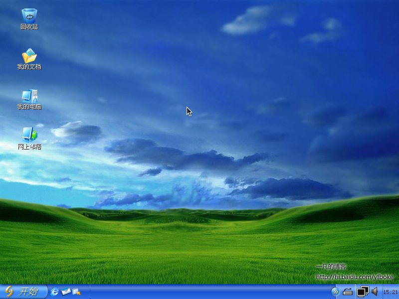
 进入桌面 哇 和xp相差不多 几乎类似 功能也类似
 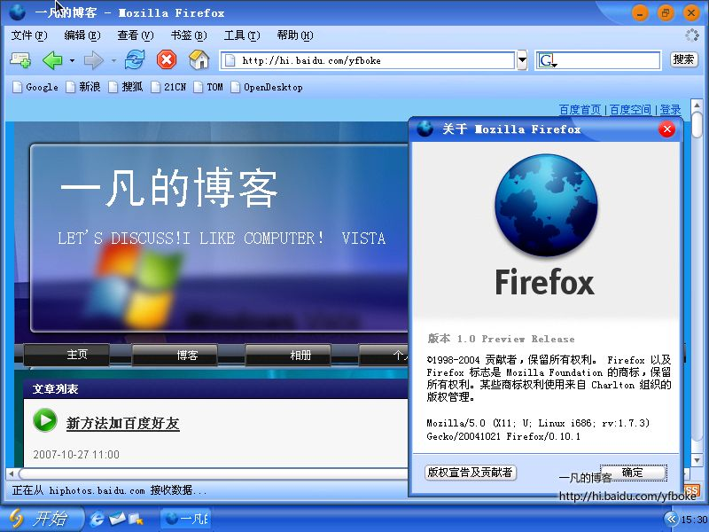
 看看浏览器 是firefox的 呵呵 还挺好用
 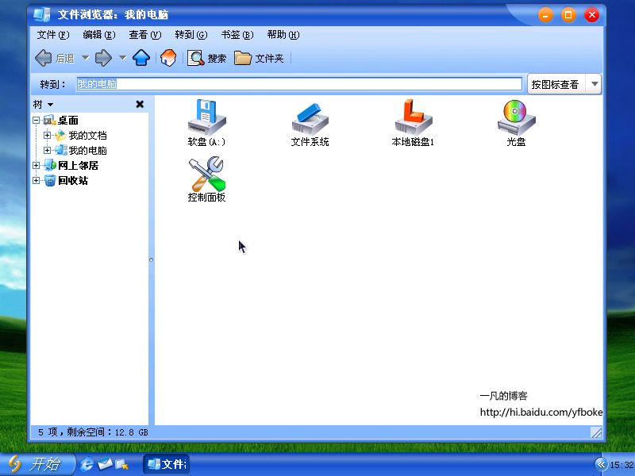
 很像xp
 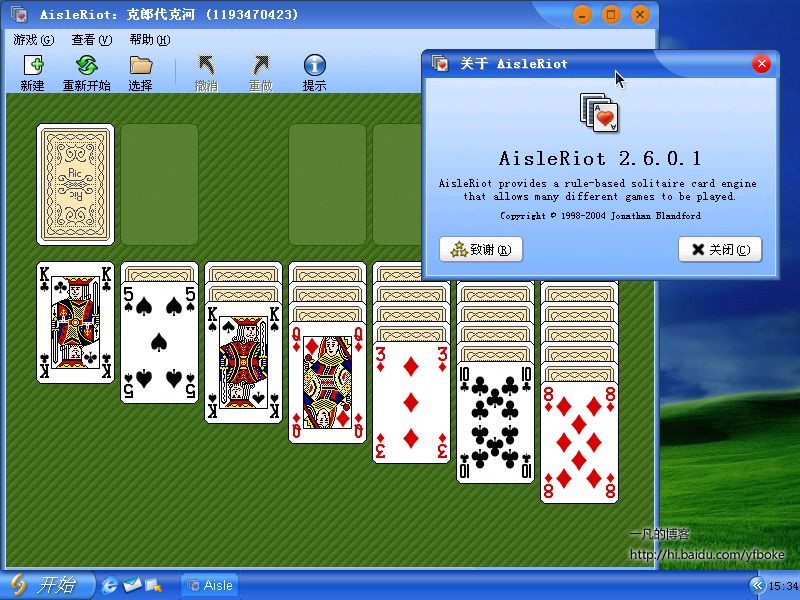
 纸牌 呵呵 跟xp也有点像
 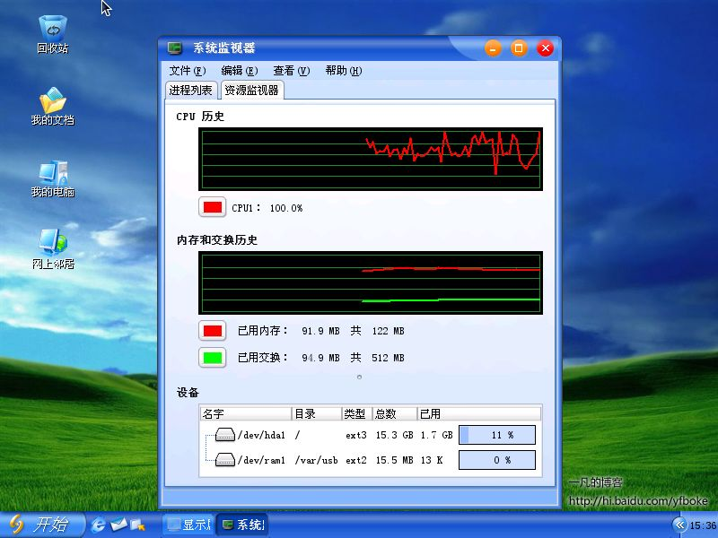
 类似于xp的任务管理器 这里叫系统监视器
 
 控制面板 图标比xp强多了 功能强悍
 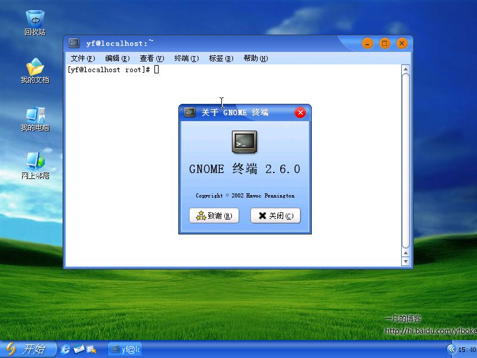
 linux最基础的东西 -终端===========================================================================呵呵，我还是linux菜鸟，高手不要笑我，今天按了一下linux玩玩，感觉不错，很爽，这个系统虽然很像xp，但是从我多年研究windows来看，内核比windows稳定多了，感觉很有发展空间，系统超像xp，不是一般的像。===========================================================================欢迎留言

