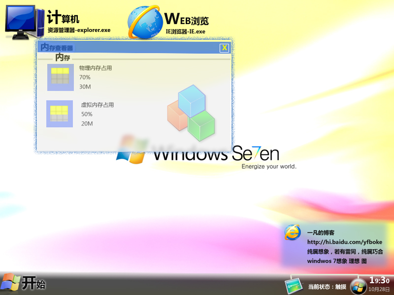
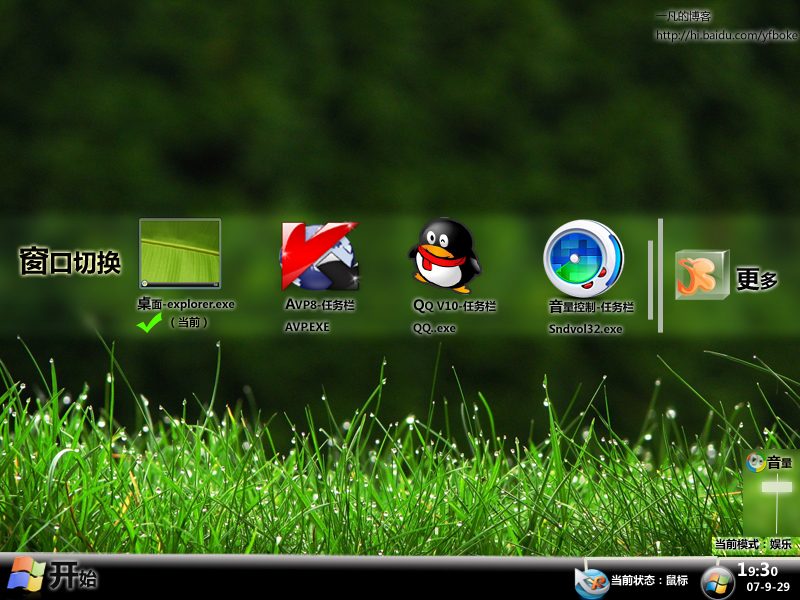
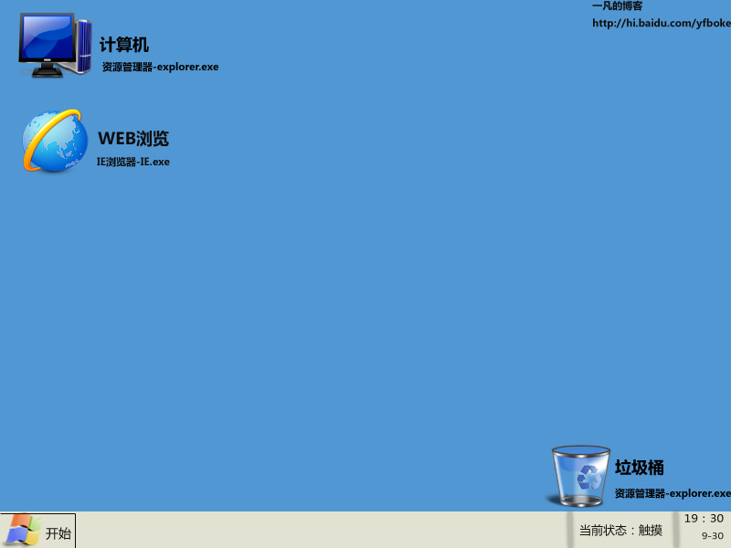

# Windows 7 想象图-一凡原"画"（有更新） 

> 2007-10-28

 

  <strong>
   这个并不是未来的win7，只是我的个人思想
  </strong>
 

 
 风格1呵呵，风格2在下面==========================================================================
 
 风格2
 
 风格3，最有可能制作软件：photoshop          制作者：一凡关于windows 7：windwos 7是vista的下一代windows系统，至今没有正式的名字，故叫win7，由于微软严格限制没有透露出win7的任何消息，所以本人自己做了个想象和理想图感谢png图片的提供者，任务栏完全是我自己画出来的，背景是网上查出来的，中间的一个窗口的标题栏考虑到win7占内存小，所以应该比较简洁，桌面的图标就是上面的“计算机”和“web浏览”是我理想中的系统桌面图标，共花费我1.4个小时.欢迎留言可以转载，但是必须在下面声明

