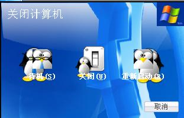
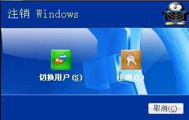
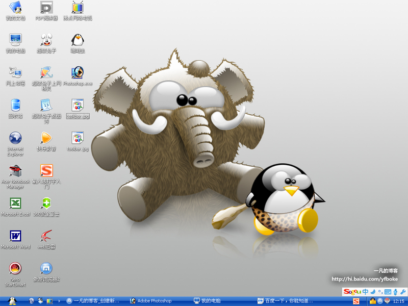

# 让xp变成linux 

> 2007-10-28

 

  最近看linux的外观挺好看的，所以我想用xp仿它
 

 

  所以我安装了“仿LINUX主题Pack Crystal XP 3.rar”，共15m
 

 

  必须用迅雷下载 ：
 

 

  
 

 

  下面是我安装后的截图
 

 
 任务栏
 
 工具栏
 
 关机
 
 主题切换
 
 注销
 
 全景图

