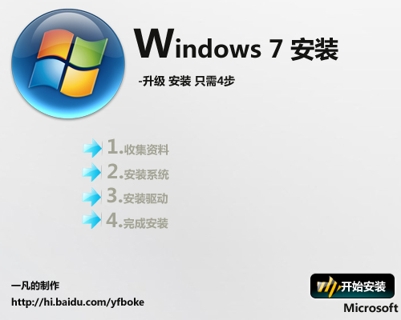
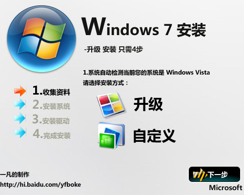
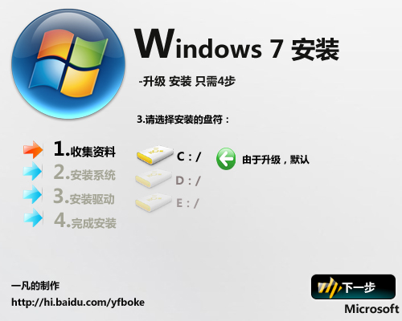
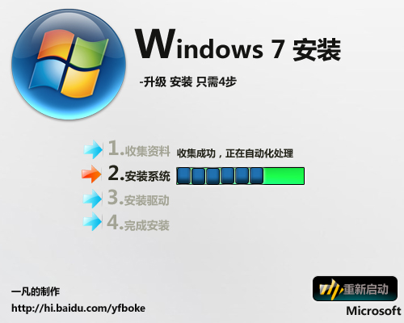
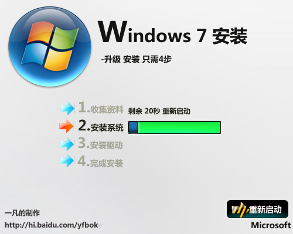
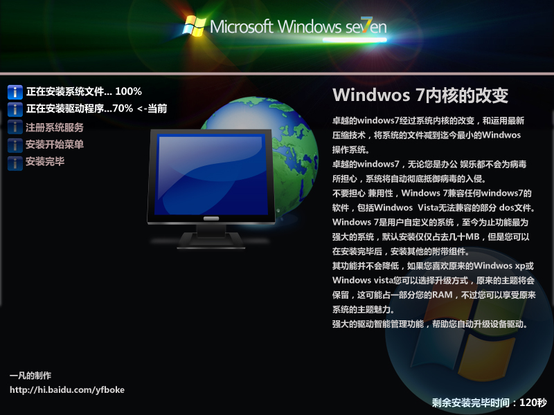
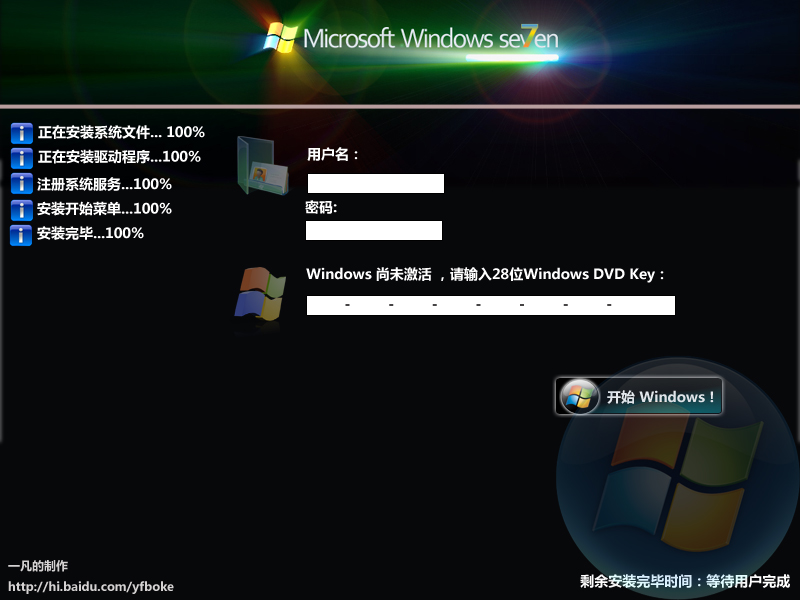

# Windows 7 安装图 一凡原画 注意：是想象的！安装图！ 

> 2007-10-31

 

  像前一个博客文章一样，我自己想象的，非真是，纯属虚构，欢迎大家讨论
 

 

  
 

 

  第一步
 

 

  
 

 

  第二步
 

 

  
 

 

  第三步
 

 

  
 

 

  第四步
 

 

  
 

 

  自动化
 

 

  
 

 

  重启
 

 

  
 

 

  安装时，上面的一段字是我自己编的
 

 

  
 

 

  安装完毕
 

 欢迎讨论哦

