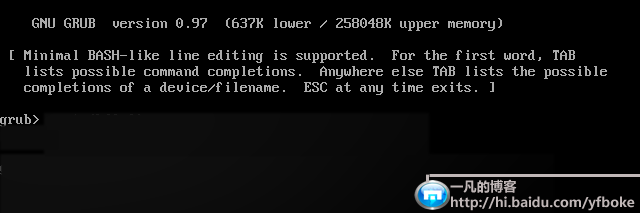
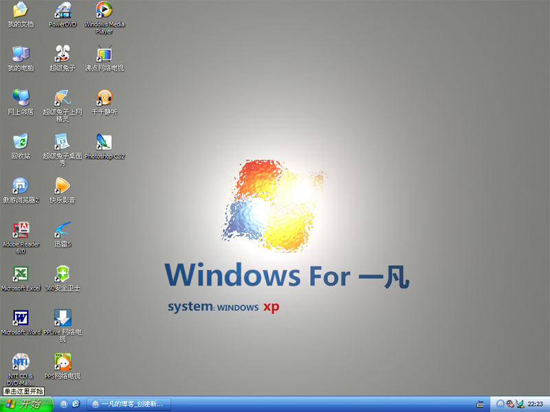
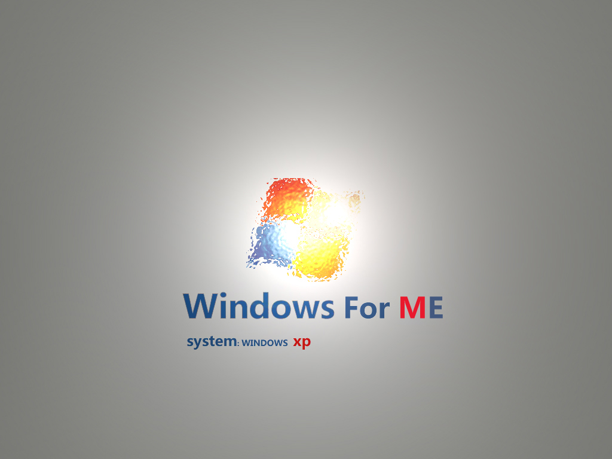

# 晕~~~卸载linux带来的麻烦 

> 2007-11-02

 

  哎~~~本来以为把linux的盘格式化就行了
 

 

  其实不然，格式化以后。。。
 

 

  开机的grub的那个东西还存在，根本无法进入windows
 

 

  如图：
 

 

 

 
 

  没办法，只好还原系统，害得我ghost两次，因为第一次中间出现错误。。。
 

 

  终于进入了系统，还要安装常用软件哎。。。网速慢，下载慢
 

 

  现在才全部安装完毕。。。桌面壁纸是我自己做的
 

 

 

 

  
 

 

  （800*600的，1024*786的那个太大，放不下）
 

 

  壁纸是10分钟做好的，做得不好，有空好好作几张，想要的下面另存为（把 一凡 改为了 ME）
 

 

 

 

