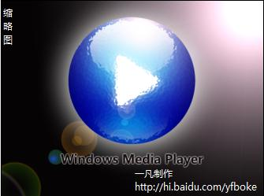

# WMP风格的壁纸 

> 2007-11-03

 

  最近对photoshop感点兴趣，于是就自己做了一个壁纸，呵呵，有点简单，望高手指导
 

 

  壁纸（1024*768）
 

 

  
 

 

  下面是缩略图
 

 

  ==========================================================
 

 

  缩略图：
 

 

  
 

 

  （下载的上下的版权信息和缩略图三个字都没有）
 

