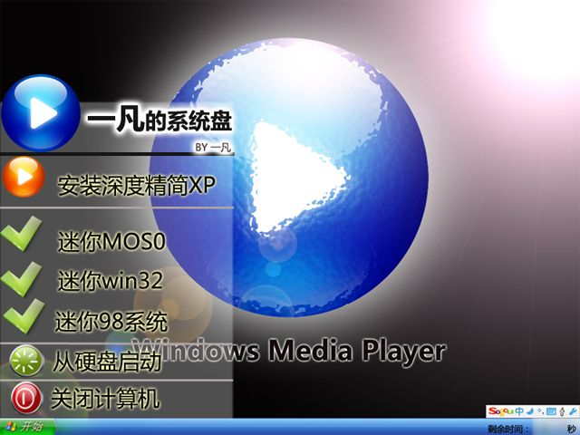

# 准备制作自己的系统盘 

> 2007-11-04

 

  哈哈，自己的系统盘，然后再刻成光盘，最后....不卖！！！收藏
 

 

  
 

 

  哈哈，正在制作中，估计要好几十天+上传
 

 

  因为我要做出一个好的作品
 

 

  关于启动盘在开机时的截图做出来了，WIN下的引导软件还没,准备用vb6编一个
 

 

  哈哈
 

 

  =============截图如下==============
 

 

  
 

