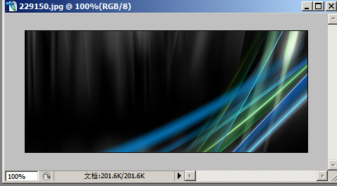
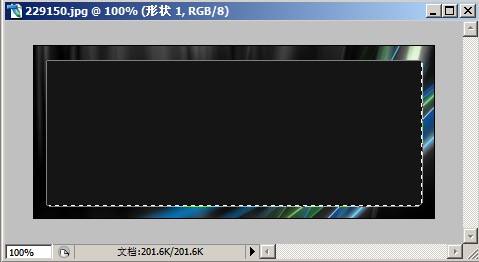
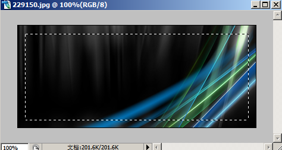
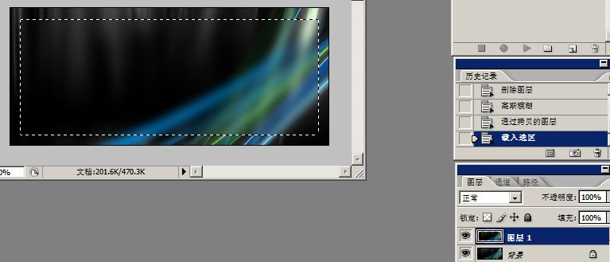
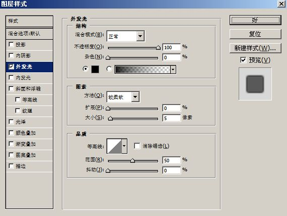
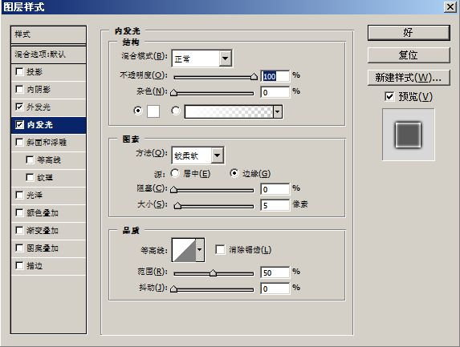

# Photoshop 毛玻璃（aero）效果制作方法 

> 2007-11-06

 

  
 

 

  呵呵，其实也很简单。大家仔细看就行了
 

 

  方法分4步
 

 

  ===================================================
 

 

  ===================================================
 

 

  <strong>
   FIRST
  </strong>
 

 

  Open a picture
 

 

  打开一个图片
 

 

  
 

 

  <strong>
   NEXT
  </strong>
 

 

  工具栏-圆角矩形工具 半径3像素
 

 

  画出如图所示的图 并选中这个画，按CTRL+图层里的形状一
 

 

  
 

 

  <strong>
   THEN
  </strong>
 

 

  然后，删除选取 按下键盘del
 

 

  
 

 

  <strong>
   AFER THAR
  </strong>
 

 

  把选区用
 

 

  滤镜-模糊-高斯模糊-半径5.0
 

 

  模糊一下
 

 

  然后在通过拷贝得到新的图层
 

 

  如图
 

 

  
 

 

  <strong>
   FINALLY
  </strong>
 

 

  将这个图层进行如图所示的混合设置
 

 

  
 

 

  
 

 

  OK，点确定就行了
 

 

  至于文字和其中的png图片什么的自己添加吧
 

 

  
 

