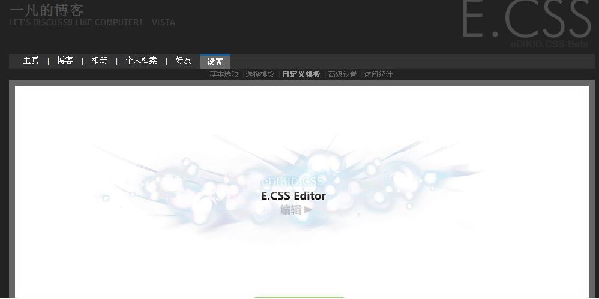

# 昨天刚刚开通了E.CSS技术 今天就有问题了 

> 2007-11-08

 

  汗！
 

 

  经52abc紧急通知：
 

 

  

   E.CSS暂时使用极简白模板,现在E.CSS的激活出现了问题,此事正在联系处理中.
  

  

   此期间,请不要更换模板,否则将可能永远再用不了E.CSS!!!!
  

 

 

  所以在此期间我只能用极度白模版如果还想看到我以前的模版
 

 

  原来的模版：
  <a href="http://hi.baidu.com/yfboke/modify/preview/7bcb0a460bdaeb096b63e5a2.css">
   http://hi.baidu.com/yfboke/modify/preview/7bcb0a460bdaeb096b63e5a2.css
  </a>
 

 

  大概问题可能是服务器不足吧~~~
 

 

  汗死 下面是E.CSS图
 

 

 

 

