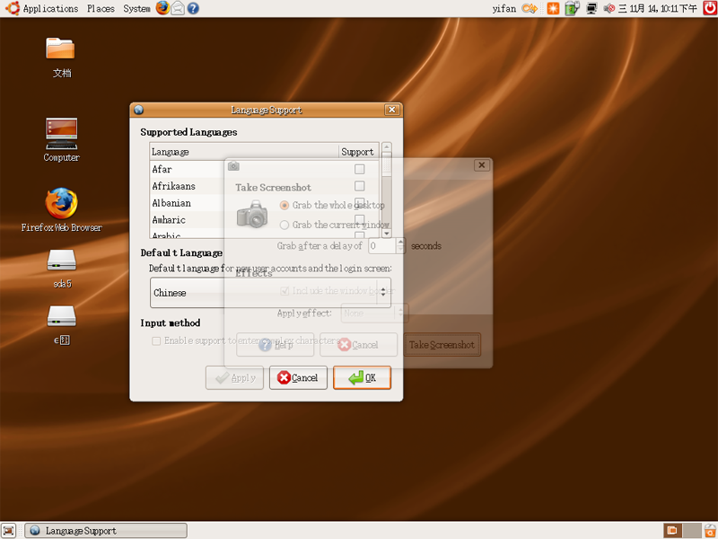

# 昨天体验了一下ubuntu 

> 2007-11-15

 

  <strong>
   我似乎遇到了一些问题...【已解决】
  </strong>
 

 

  安装一切顺利，但是安装后：大多数文字是中文，也有很多英文的，即 英文中文混合型语言（哈哈，乱编的）
 

 

  我开始选择更改语言，提示语言没有安装完整，于是根据abc提示，我去把软件源的设置改了一下，但是这次就出问题了，等再进入选择语言的对话框时，仍然提示没有安装完整，我选择安装按钮，然后就下载了文件并且安装了，但是语言还是没有变化，输入法仍然没有，后来我再改语言已经没有用了，没有 没有安装完整的提示了，没办法，我只能在windows。
 

 

  另：ubuntu系统确实很好，很漂亮！
 

 

  图：
 

 

  
 

 

  （点击放大）
 

 

  <strong>
   本站firefox无法访问的，可以将页面风格设置为 无风格即可看到。
  </strong>
 

 

  原因：系统的中文语言没有安装完整，中文语言没有打勾，感谢abc的帮助
 

