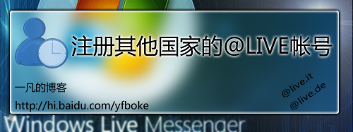
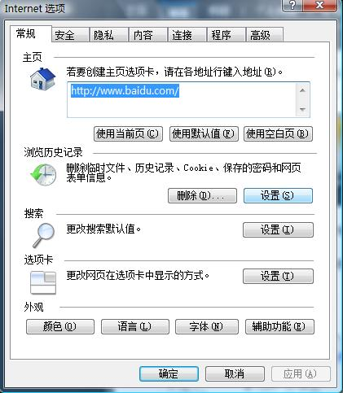
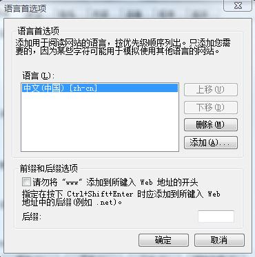
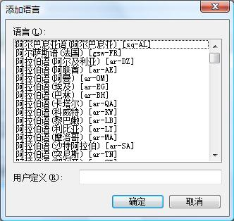

# IE 注册其他国家的@live帐号方法 

> 2007-11-18

 

  
 

 

  o(∩_∩)o...从
  <a href="http://hi.baidu.com/52abc/blog/item/fffc0955626b40c7b645ae20.html" target="_blank">
   52abc那里的文章
  </a>
  来的思路
 

 

  52abc仅仅介绍了如何用
  <strong>
   foxfire
  </strong>
  的注册方法，我来补充介绍IE注册的方法
 

 

  ========================我是分割线，下面是介绍===========================
 

 

  首先进入IE的INTERNET选择
 

 

  
 

 

  选择语言
 

 

  
 

 

  删除中文 中国 然后点击添加...
 

 

  
 

 

  选择比如 德语（德国）[De-de]
 

 

  然后确定-确定-确定
 

 

  再浏览
 

 

  <a href="http://get.live.com/getlive/overview" target="_blank">
   http://get.live.com/getlive/overview
  </a>
 

 

  进行注册，就可以看到 下拉框有live.de的了
 

 

  哈哈！大家还可以尝试
 

 

  live.fr(法国)
 

 

  live.cn（中国）
 

 

  live.uk（英国）
 

 

  live.it（意大利）
 

 

  live.nl（荷兰）
 

 

  还有很多....等着你去发掘
 

 

  o(∩_∩)o...慢慢注册
 

 

  我注册了个情侣号
 

 

  <a href="http://hi.baidu.com/yfboke/blog/item/7b1bb85cff49e340fbf2c0c3.html">
   http://hi.baidu.com/yfboke/blog/item/7b1bb85cff49e340fbf2c0c3.html
  </a>
 

