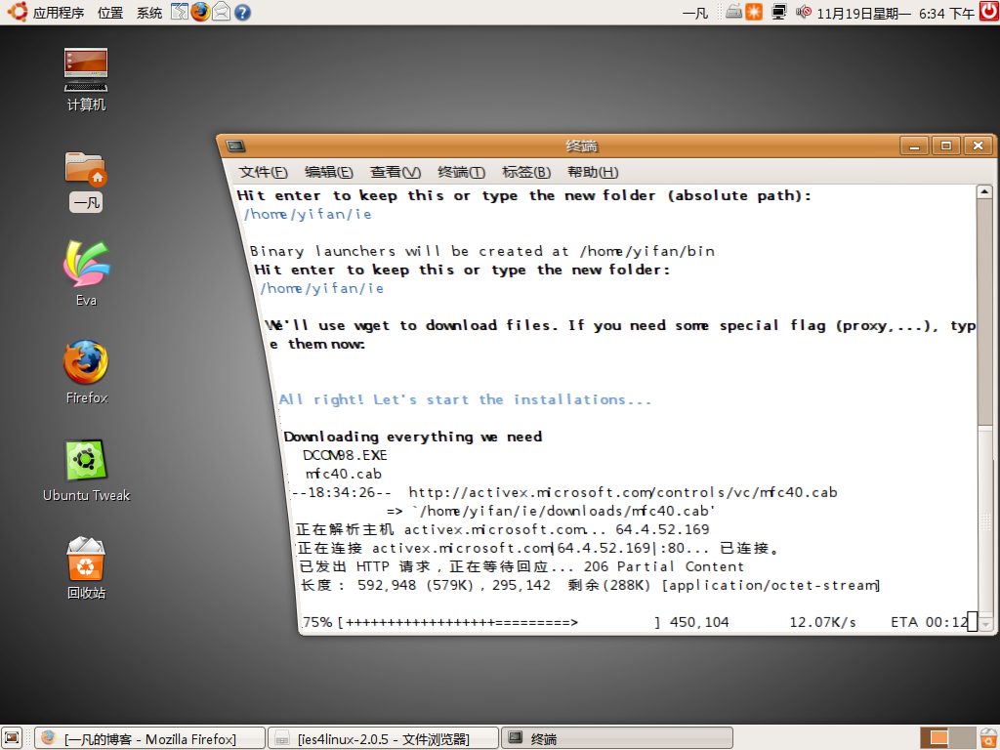
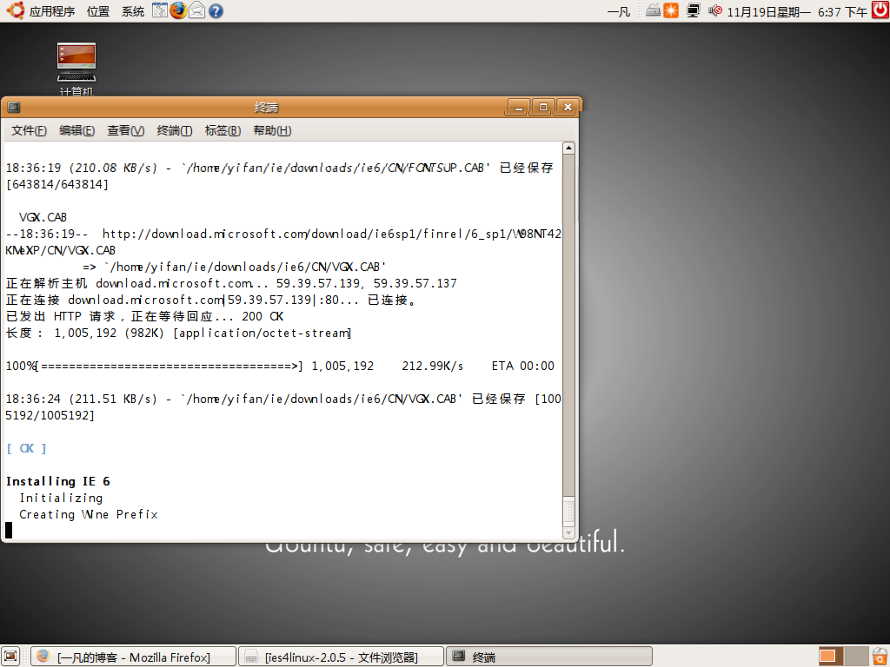
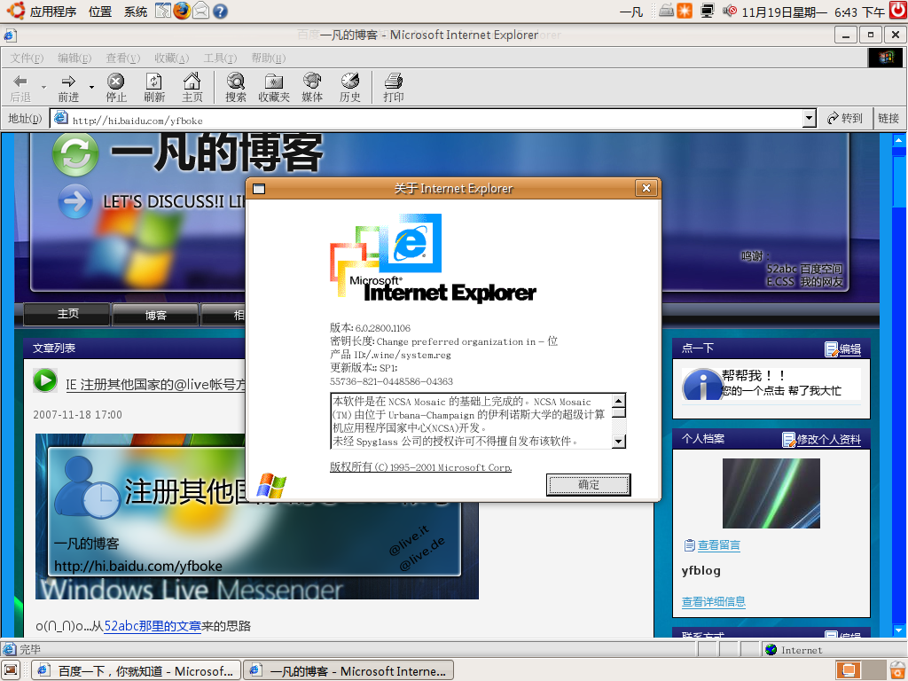

# UBUNTU 安装IE 

> 2007-11-19

 

  UBUNTU 安装IE
 

 

  呵呵，最近安装Ubuntu后，用FIREFOX不能浏览我的博客感觉不爽，因为我是E.CSS用户，原理就不多说了。我打算安装个IE，所以下面是安装过程：（网上学来的，非原创）
 

 

  <strong>
   linux下安装IE的必要性如果使用firefox久了，你就会发现，很多网页使用firefox是有一定难度的，不 是按扭点不开，就是功能或访问受限，因此linux下安个 IE很有必要。在 Linux 下运行 Windows的IE，当然是 wine了 ，如果你不嫌麻烦，也可以自己配置，但是有人已经为我们做了这些配置的工作，那么我们直接拿来用。打开终端，开始工作! 先确保你的源里有 universe 一项，没有的话打开编辑一下。
  </strong>
 

 

  <strong>
   sudo nano
  </strong>
  <strong>
   我的 feisty 源是这个 deb
  </strong>
  <a href="http://ubuntu.cn99.com/ubuntu/">
   <strong>
    http://ubuntu.cn99.com/ubuntu/
   </strong>
  </a>
  <strong>
   feisty main restricted universe multiverse deb-src
  </strong>
  <a href="http://ubuntu.cn99.com/ubuntu/">
   <strong>
    http://ubuntu.cn99.com/ubuntu/
   </strong>
  </a>
  <strong>
   feisty main restricted universe multiverse deb
  </strong>
  <a href="http://ubuntu.cn99.com/ubuntu/">
   <strong>
    http://ubuntu.cn99.com/ubuntu/
   </strong>
  </a>
  <strong>
   feisty-updates main restricted universe multiverse deb-src
  </strong>
  <a href="http://ubuntu.cn99.com/ubuntu/">
   <strong>
    http://ubuntu.cn99.com/ubuntu/
   </strong>
  </a>
  <strong>
   feisty-updates main restricted universe multiverse deb
  </strong>
  <a href="http://ubuntu.cn99.com/ubuntu/">
   <strong>
    http://ubuntu.cn99.com/ubuntu/
   </strong>
  </a>
  <strong>
   feisty-backports main restricted universe multiverse deb-src
  </strong>
  <a href="http://ubuntu.cn99.com/ubuntu/">
   <strong>
    http://ubuntu.cn99.com/ubuntu/
   </strong>
  </a>
  <strong>
   feisty-backports main restricted universe multiverse deb
  </strong>
  <a href="http://uuntu.cn99.com/ubuntu/">
   <strong>
    http://uuntu.cn99.com/ubuntu/
   </strong>
  </a>
  <strong>
   feisty-security main restricted universe multiverse deb-src
  </strong>
  <a href="http://ubuntu.cn99.com/ubuntu/">
   <strong>
    http://ubuntu.cn99.com/ubuntu/
   </strong>
  </a>
  <strong>
   feisty-security main restricted universe multiverse deb
  </strong>
  <a href="http://ubuntu.cn99.com/ubuntu/">
   <strong>
    http://ubuntu.cn99.com/ubuntu/
   </strong>
  </a>
  <strong>
   feisty-proposed main multiverse restricted universe deb-src
  </strong>
  <a href="http://ubuntu.cn99.com/ubuntu/">
   <strong>
    http://ubuntu.cn99.com/ubuntu/
   </strong>
  </a>
  <strong>
   feisty-proposed main restricted
  </strong>
 

 

  <strong>
   首先准备一些软件：
  </strong>
 

 

  <strong>
   sudo apt-get update sudo
  </strong>
 

 

  <strong>
   apt-get install wine cabextract
  </strong>
 

 

  <strong>
   然后下载自动安装脚本： wget
  </strong>
  <a href="http://www.tatanka.com.br/ies4linux/downloads/ies4linux-latest.tar.gz">
   <strong>
    http://www.tatanka.com.br/ies4linux/downloads/ies4linux-latest.tar.gz
   </strong>
  </a>
  <strong>
   下载完成后，解压缩，进入目录： tar zxvf ies4linux-latest.tar.gz cd ies4linu-* 然后运行 ./ies4linux 程序会问你几个问题，默认安装IE6，问你要不要装 IE5，IE 5.5 之类，根据自己情况选 yes 或 no 吧。配置完毕后程序自动开始从微软网站上下载程序，并写好启动脚本，放在你的 home 目录下的 bin 目录下。 启动 IE6 ，进入自家的 bin 目录，运行 ./ie6 怎么样，方便快捷吧。
  </strong>
 

 

  <strong>
   当然也可以创建启动项放在桌面上。
  </strong>
 

 

  ＝＝＝＝＝＝＝＝＝＝＝＝＝＝＝＝＝＝＝＝＝＝＝＝＝＝＝＝＝＝下面是我的截图（原创）
 

 

  
 

 

 

 

  
 

 

 

 

