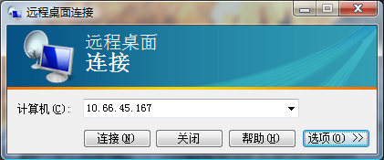
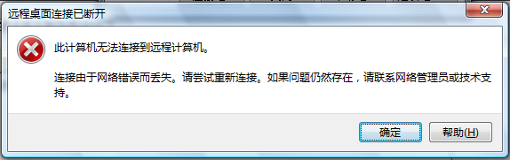

# 傻了，对VISTA的远程控制功能说88了 

> 2007-12-01

 

  今天想试试VISTA的远程控制功能
 

 

  <strong>
   主控制机
  </strong>
 

 

  <strong>
   系统：WINDOWS VISTA HOME
  </strong>
 

 

  <strong>
   被控制机
  </strong>
 

 

  <strong>
   系统：WINDOWS XP SP2
  </strong>
 

 

  首先查询了两计算机的IP，测试成功。
 

 

  我打开VISTA机的远程桌面连接
 

 

  
 

 

  进行了如图配置。
 

 

  然后连接提示：
 

 

  
 

 

  晕！难道是网络问题？
 

 

  我用了别人的XP连接了一下，结果成功！汗！！！
 

 

  检查配置：一切正常
 

 

  于是我又换了一台VISTA连接XP仍然如此。
 

 

  XP有连接了一下VISTA，跟这个提示差不多！
 

 

  微软明明提示XP与VISTA可以远程控制
 

 <u>
  使用远程桌面连接连接到其他计算机
 </u>
 

 

 

  <u>
   使用远程桌面连接，可以从一台运行 Windows 的计算机访问另一台运行 Windows 的计算机，条件是两台计算机连接到相同
  </u>
  <u>
   或连接到 Internet。例如，可以在家中的计算机使用所有工作的计算机的程序、文件及网络资源，就像坐在工作场所的计算机前一样。
  </u>
 

 

  <u>
   若要连接到远程计算机，该计算机必须为开启状态，必须具有网络连接，远程桌面必须可用，必须能够通过网络访问该远程计算机（可通过 Internet 实现），还必须具有连接权限。若要获取连接权限，您必须位于用户列表中。以下步骤介绍了如何将名称添加到该列表中。
  </u>
 

 <u>
  注意
 </u>
 <ul>
  <li>
   

    <u>
     无法使用远程桌面连接连接到运行 Windows Vista Starter、Windows Vista Home Basic、Windows Vista Home Basic N 或 Windows Vista Home Premium 的计算机，只能从这些版本的 Windows Vista 创建接出连接。
    </u>
   

  </li>
 </ul>
 <ul>
  <li>
   

    <u>
     无法使用远程桌面连接连接到运行 Windows XP Home Edition 的计算机。
    </u>
   

  </li>
 </ul>
 

  彻底晕了，没办法正准备换回XP时代。
 

