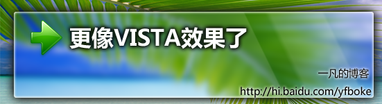
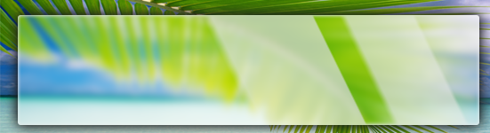
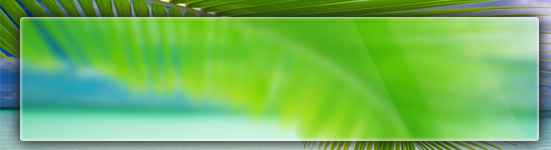
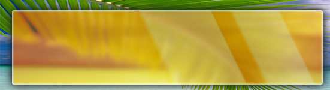
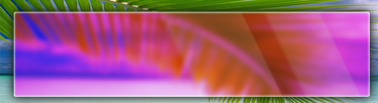
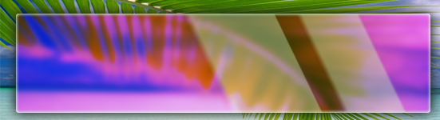

# 更像vista的毛玻璃PS图 o(∩_∩)o...一凡原创 

> 2007-12-01

 

  <strong>
   感觉这个 毛玻璃 PS图 好多了
  </strong>
 

 

  <strong>
   呵呵，自己无聊，又有了思路，做了个比较像VISTA的aero的毛玻璃图
  </strong>
 

 

  
 

 

  呵呵，是不是更像了？
 

 

  自己想的，下面是
 

 

  各种颜色的aero的毛玻璃效果，大家可以套用然后做个标题然后写日志用，比较有个性！！！
 

 

 

 

  
 

 

  <strong>
   白
  </strong>
 

 

  
 

 

  <strong>
   绿
  </strong>
 

 

  
 

 

  <strong>
   黄
  </strong>
 

 

  <strong>
   
  </strong>
 

 

  <strong>
   粉
  </strong>
 

 

  <strong>
   
  </strong>
 

 

  <strong>
   紫
  </strong>
 

 

  <strong>
   呵呵，无聊时做的，可以让新手方便做个PS图。
  </strong>
 

 

  <strong>
   其中粉和红比较像，蓝色的我忘做了，因为第一个就是蓝色的。
  </strong>
 

 

  <strong>
   蓝色就不共享，因为困了~~
  </strong>
 

 

  <strong>
   :)
  </strong>
 

 

  <strong>
   其实颜色问题是用了CTRL+M那个设置，调了一下
  </strong>
 

 

  <strong>
   玻璃的光泽，使用了颜色渐变叠加，自己做了个渐变，其实也很简单
  </strong>
 

 

  <strong>
   相关文章
  </strong>
 

 

  <strong>
   <a href="http://hi.baidu.com/yfboke/blog/item/7aaa7d3b5b515de914cecb7d.html">
    http://hi.baidu.com/yfboke/blog/item/7aaa7d3b5b515de914cecb7d.html
   </a>
  </strong>
 

 

  ====================================
 

 

  转载可以，不要忘了我一凡啊·~~~~~~~~~~~~
 

 

  ====================================
 

