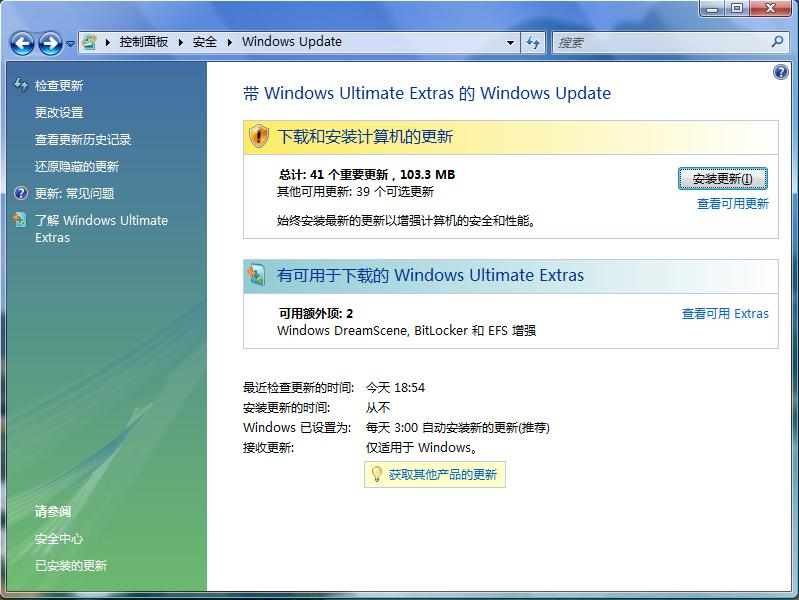
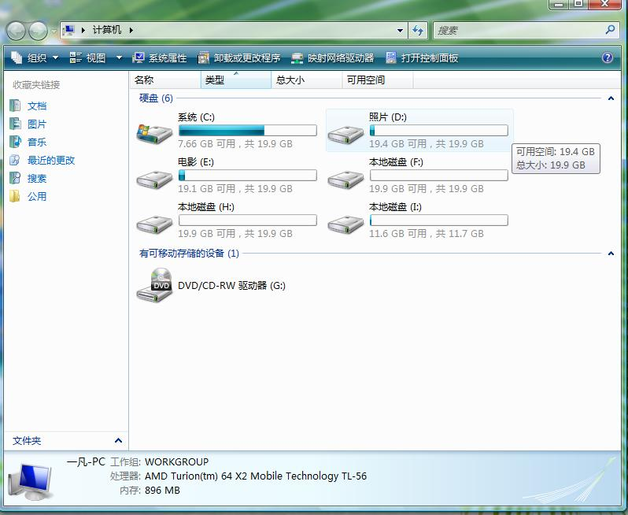
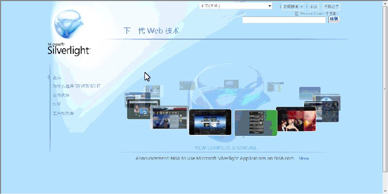

# 重新安装了vista 

> 2007-12-15

 

  
 

 

  哎~~~一次失误，失误的低格了硬盘。
 

 

  没办法，只好重装vista.20分钟搞定~
 

 

  装驱动.3个小时搞定~ATI驱动120M多，这么大的显卡驱动，哎~~~~~~
 

 

  回来一看，自动更新。
 

 

  哇~~103M，我也勾了梦幻桌面
 

 

  =====================================================
 

 

  我是分隔线，o(∩_∩)o...下面是图片
 

 

  =====================================================
 

 

  
 

 

  <strong>
   重大发现：现在再安装vista，不需要再下载英文语言包直接就可以安装中文版仅8M的梦幻桌面。
  </strong>
 

 

  后来用我的U盘安装其他文件，哎~~~2个小时，弄了1天。
 

 

  最后看看开机后所占用的内存，系统+驱动（无病毒和垃圾软件）=800M，哎~~~~
 

 

  还好，我的系统1G。要不然卡死。开启梦幻桌面，1G。
 

 

  关闭AERO还好，600M，说明AERO占200M~~~~
 

 

  太麻烦了，一下疏忽导致我重新分了6个区
 

 

  
 

 

  <strong>
   ===================================================================================================
  </strong>
 

 

  <strong>
   另外，发现了一个微软的类似flash的新技术
  </strong>
 

 

  被称为 下一代WEB网页插件
 

 

  下载地址
 

 

  
  该地址为微软官方下载
 

 

  <a href="http://silverlight.dlservice.microsoft.com/download/6/1/7/61793C82-4DDF-4C96-B395-2F26B207EEE7/Silverlight.1.0.exe">
   ht
  </a>
  <a href="http://silverlight.dlservice.microsoft.com/download/6/1/7/61793C82-4DDF-4C96-B395-2F26B207EEE7/Silverlight.1.0.exe">
   tp://silverlight.dlservice.microsoft.com/download/6/1/7/61793C82-4DDF-4C96-B395-2F26B207EEE7/Silverlight.1.0.exe
  </a>
 

 

  我安装了一下，感觉比flash强，是微软开发的。
 

 

  但是不能代替flash，现在只有一个网页引用了该插件，那就是////
 

 

  <a href="http://www.microsoft.com/silverlight/default_ns.aspx">
   http://www.microsoft.com/silverlight/default_ns.aspx
  </a>
 

 

  安装后才能看到。
 

 

  图片gif格式的，压缩得不是很好。
 

 

