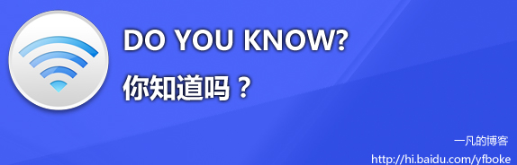

# 手机即将进入3G时代 

> 2007-12-16

 

  
 

 

  <strong>
   从QQ wap网的3G.QQ.COM 到《命运呼叫转移》的电影中，都没有离开3G二字.
  </strong>
 

 

  <strong>
   《命运呼叫转移》电影中第一个短片的最后一句经典的话那就是：
  </strong>
 

 

  <strong>
   手机即将进入准3G时代 3G时代 时代....
  </strong>
 

 

  <strong>
   那么，3G时代到底是什么呢？
  </strong>
 

 

  <strong>
   今天网上网查了1下，原来是这样。
  </strong>
 

 

  <strong>
   3G
  </strong>
  是3rd Generation的缩写，指第三代移动通信技术。相对第一代模拟制式手机(1G)和第二代GSM、TDMA等数字手机(2G)，第三代手机是指将无线通信与互联网等多媒体通信结合的新一代移动通信系统。它能够处理图像、音乐、视频流等多种媒体形式，提供包括网页浏览、电话会议、电子商务等多种信息服务。CDMA被认为是第三代移动通信(3G)技术的首选，目前的标准有WCDMA、CDMA2000、GSM/2G
   
   
  GSM(全球移动通信：Global System For Mobile Communication)是1992年欧洲标准化委员会统一推出的标准，它采用数字通信技术、统一的网络标准，使通信质量得以保证，并可以开发出更多的新业务供用户使用。GSM移动通信网的传输速度为9.6K/s。目前，全球的GSM移动用户已经超过5亿，覆盖了1/12的人口，GSM技术在世界数字移动电话领域所占的比例已经超过70%。由于GSM相对模拟移动通讯技术是第二代移动通信技术，所以简称2G。目前，我国拥有8000万以上的GSM用户，成为世界第一大运营网络。
   
   
  GPRS
   
   
  GPRS(通用无线分组业务：General Packet Radio Service)是一种基于GSM系统的无线分组交换技术，提供端到端的、广域的无线IP连接。简单的说，GPRS是一项高速数据处理的技术，其方法是以“分组”的形式传送数据。网络容量只在所需时分配，不要时就释放，这种发送方式称为统计复用。目前，GPRS移动通信网的传输速度可达115k/s。GPRS是在GSM基础上发展起来的技术，是介于第二代数字通信和第三代分组型移动业务之间的一种技术，所以通常称为2.5G。
   
   
  WAP
   
   
  WAP(无线应用通讯协议：Wireless Application Protocol)是移动通信与互联网结合的第一阶段性产物。这项技术让使用者可以用手机之类的无线装置上网，透过小型屏幕遨游在各个网站之间。而这些网站也必须以WML(无线标记语言)编写，相当于国际互联网上的HTML(超文件标记语言)。打个比喻，GPRS和GSM都是马路，而WAP是在马路上的汽车。中国移动开通GPRS之后，WAP就行驶在GSM和GPRS两条马路上，而行驶在GPRS的马路上可以提高数据传输速度。因此，现有WAP上的内容一样可以通过GPRS进行浏览和应用。WAP是2.5G的协议。
 

 

  <strong>
   总结，原来就是GSM.GPRS.WAP。你知道了吗？
  </strong>
 

