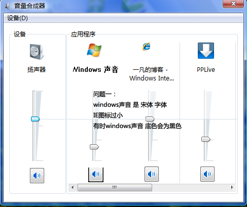
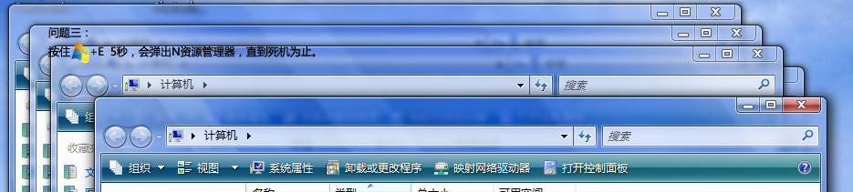

# Vista的3个问题 

> 2007-12-31

 

  发现了3个vista问题，希望微软解决
 

 

  ====================================================================
 

 

  三个问题，请您打开查看
 

 

  ====================================================================
 

 

 

 

  问题一：
 

 

  
 

 

  问题二：
 

 

  
 

 

  问题三
 

 

