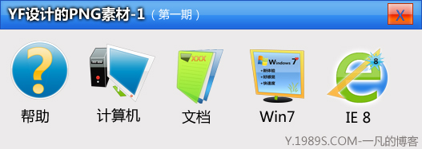
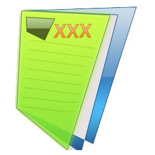
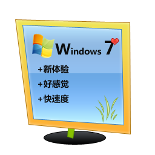

# 新年贺礼-送大家自己做的PNG，感觉还行吧~~~ 

> 2007-12-31

 

  新年到了--2008
 

 

  <strong>
   小弟在此做了5个PNG图片，感觉不错，40分钟做成。
  </strong>
 

 

  
 

 

  小小贺礼，不成敬意
 

 

  =================================================================
 

 

  文件另存为，1.png，2.png，3.png，4.png
 

 

  即可
 

 

  欢迎各大网站，各小网站，转载
 

 

  =================================================================
 

 

  PNG1（256*256）：
 

 

  
 

 

  PNG2（256*256）：
 

 
 

  PNG3（256*256）：
 

 
 

  PNG4（256*256）：
 

 

  
 

 

  PNG5（256*256）：
 

 

  
 

 

  <strong>
   PS:个人感觉，PNG2和PNG3做得不错~其他几个感觉不太理想，主要是没有思路
  </strong>
 

 

  <strong>
   制作工具：PS，制作时间：07年最后一天，制作方法：主要以钢笔工具制作而成
  </strong>
 

