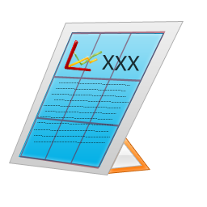

# PNG-2来啦~~~这回的制作，感觉不如上回~~~ 

> 2008-01-01

 

  无聊，继续我的PNG素材吧~~~~
 

 

  <strong>
   小弟在此做了4个PNG图片，感觉不错，还是40分钟做成。
  </strong>
 

 

  
 

 

  =================================================================
 

 

  文件另存为，6.png，7.png，8.png，9.png
 

 

  即可
 

 

  欢迎各大网站，各小网站，转载
 

 

  =================================================================
 

 

  PNG6（256*256）：
 

 
 

  PNG7（256*256）：
 

 
 

  PNG8（256*256）：
 

 
 

  PNG9（256*256）：
 

 
 

 

 

  <strong>
   PS:个人感觉，PNG6和PNG7做得不错~其他几个感觉不太理想，主要是没有思路
  </strong>
 

 

  <strong>
   制作工具：PS，制作时间：08年的第一天，制作方法：主要以钢笔工具制作而成
  </strong>
 

