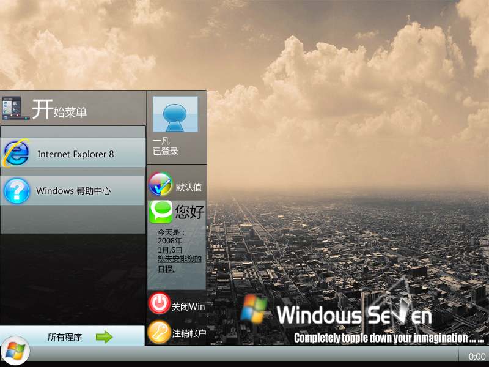
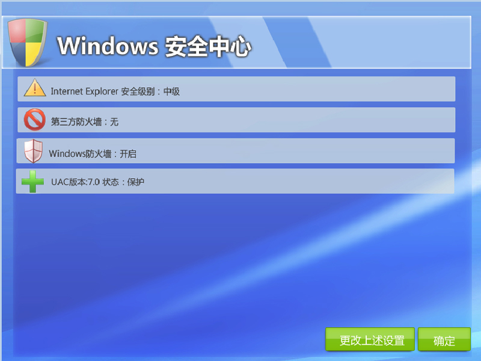
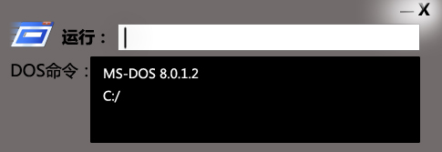

# Windows 7 想象图 第二版~~~更新版 

> 2008-01-05

 

  
 

 

  呵呵，第二版来啦~~~~
 

 

  感觉做的不太好哈
 

 

  此乃想象，绝非真实
 

 

  更新过了
 

 

  打开查看截图~~~~~
 

 

  PS制图，技术不高，见谅
 

 

 

 
 

 

 
 

 

 

  
 

 

  安全中心
 

 

  
 

 

  媒体中心
 

 

  
 

 

  集成Dos的运行命令
 

 

  
 

 

  强大的更新
 

 

  ============================================
 

 

  更多，正在更新中...
 

 

  ============================================
 

 

  相关文章：
 

 <a href="http://hi.baidu.com/yfboke/blog/item/332fac1b9c829bd6ad6e75cf.html" target="_blank">
  Windows 7 想象图-一凡原"画"(有更新)
 </a>
 

  <a href="http://hi.baidu.com/yfboke/blog/item/611fc738a7f7c9c1d56225b8.html" target="_blank">
   Windows 7 安装图 一凡原画 注意:是想象的!安装图!
  </a>
 

