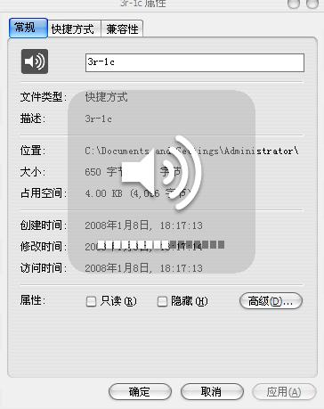

# 介绍个小软件 -仿Mac风格- 3r-1c 

> 2008-01-08

 

  
 

 

  先说点废话
 

 

  <strong>
   很酷很强大
  </strong>
 

 

  以前一直在XP仿VISTA风格，VISTA仿XP风格，2000仿linux风格
 

 

  今日，仿了一下MAC风格。苹果买不起哦~~~
 

 

  在仿MAC风格时，发现了一个小巧的软件，很美观，那就是---3r-1c
 

 

  在笔记本上用，很方便。今天介绍给大家了。
 

 

 

 

  3r-1c是模仿Mac音量调节器的Windows音量调节增强程序,可以通过“Win_+”及“Win_-”来调整音量大小。
 

 

  在笔记本中，用本本的快捷键就行啦。
 

 

  可惜的是，3r-1c集成在了MAC包里，所以大家只好一并下下来看看MAC的风采了
 

 

  
 

 

  Mac OSⅩ
   
  软件版本：1.81
   
   
  授权方式：免费软件
   
   
  软件大小：45.7MB
   
   
  下载地址：
  <a href="http://lamorine.free.fr/MacOSX/WinOSX.exe">
   http://lamorine.free.fr/MacOSX/WinOSX.exe
  </a>
 

 

  其他关于MAC OSX的文章可以看
 

 

  <a href="http://www.enet.com.cn/article/2005/0125/A20050125385376.shtml">
   http://www.enet.com.cn/article/2005/0125/A20050125385376.shtml
  </a>
 

 

 

 

 

