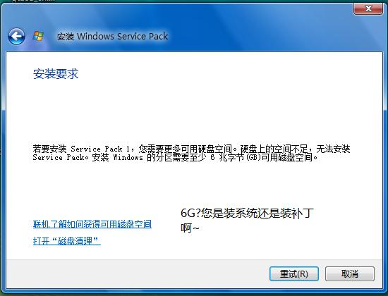

# 微软这样的占用（应该是吃）硬盘 我无法接受 

> 2008-01-18

 

  用vista1年多了。想升级SP1。可是...///
 

 

  
 

 

  什么？！SP1这么疯狂~6G~~~两个vista精简的了。
 

 

  再说。我硬盘120G，分了6个盘。一个盘20G。现在光光维持vista占10G（虚拟内存过大，因为物理内存大）软件5G 驱动1G（驱动较多，光ATI就几百兆） 游戏3G（哈哈，都是不错的游戏）
 

 

  这么一算，剩下1G。谁也不能少啊~即使是虚拟内存移动，也不够。我对微软彻底失望了。
 

 

  vista太臃肿，开机~~~占600M/1024M。
 

 

  aero开着，每多开一个程序比不开aero多占4-6M内存。汗
 

 

  经常内存到达1.6GB。我物理内存1GB，虚拟内存占了大半，这无疑是硬盘的隐形杀手
 

 

  要说稳定 很稳定 要说不稳定 可以不稳定到天了 一个病毒把vista不是非常主要的系统程序替换了 系统保护程序不停的闪 直至系统无法运行 我靠~~~
 

 

 

