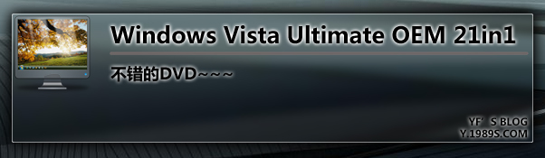
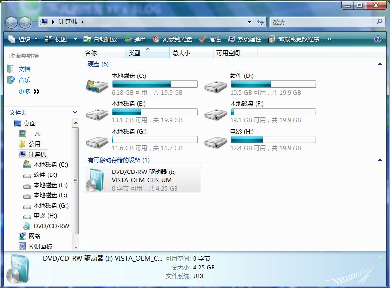
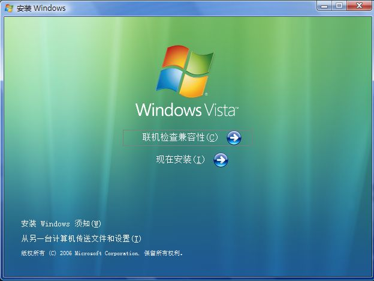
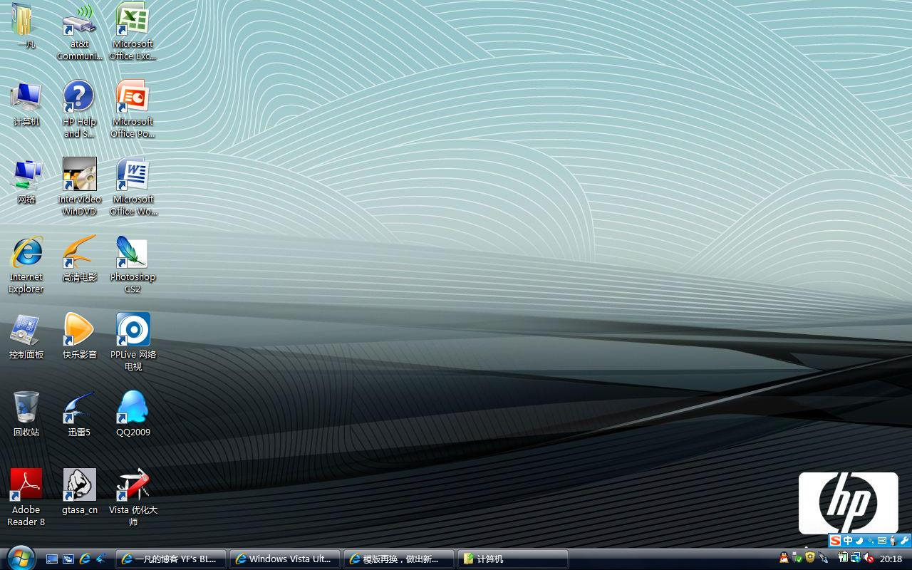

# Windows Vista Ultimate OEM 21in1 简体中文版 -安装后感言 

> 2008-01-19

 

  
 

 

  呵呵，昨天我的vsita坏了。
 

 

  昨天顺便也刻录了一张DVD-Windows Vista Ultimate OEM 21in1 简体中文版
 

 

  <a href="http://www.vistafans.com/viewthread.php?tid=180842&amp;extra=&amp;page=1">
   http://www.vistafans.com/viewthread.php?tid=180842&amp;extra=&amp;page=1
  </a>
 

 

  （速度：2-4M/S，速度不错）
 

 

  一共有21个OEM，我装的是HP的，本本配套。
 

 

  安装后，有配套的hp软件。还不错，下面是截图
 

 

 

 

  
 

 

  4.25G，充分利用DVD
 

 

  
 

 

  和原版差不多
 

 

 

 

  
 

 

  这里好多OEM啊
 

 

  
 

 

  来个总体图，点击放大（我是宽屏）
 

 

  感觉不错，就是默认不能完美激活vista（OEM版），但是硬件模拟版，我没装过，估计任何机器都能激活。
 

