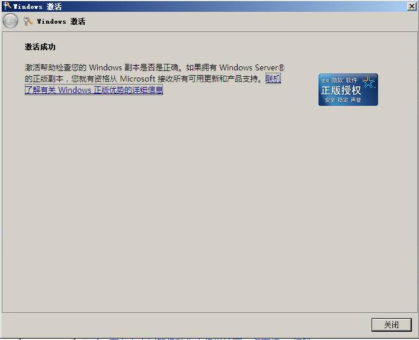

# 成功安装windows 2008 

> 2008-01-25

 

  
 

 

  最近用VISTA感觉速度很慢,于是试着使用2008.感觉不错.
 

 

  刚刚装好后,没有激活,不过我有我自己的序列号~~~~
 

 

  哈哈~~~~~~~~~~~~~~~~~~~~~~~~~~~~~~~~~~~~正版~
 

 

  这下好了可以激活了.
 

 

  没有后顾之忧了.
 

 

  WINDOWS 2008不知道了吧?
 

 

  孤陋寡闻?
 

 

  WINDOWS 2008就是向WINDWOS 2003一样
 

 

  2003是以XP为内核,2008是以VSITA为内核.
 

 

  哈哈~~~~~~
 

 

 

 

