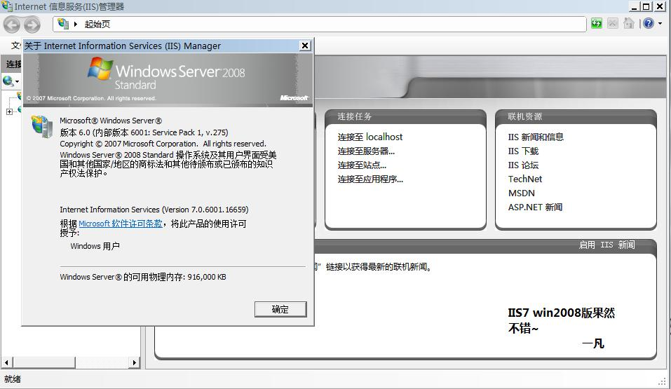
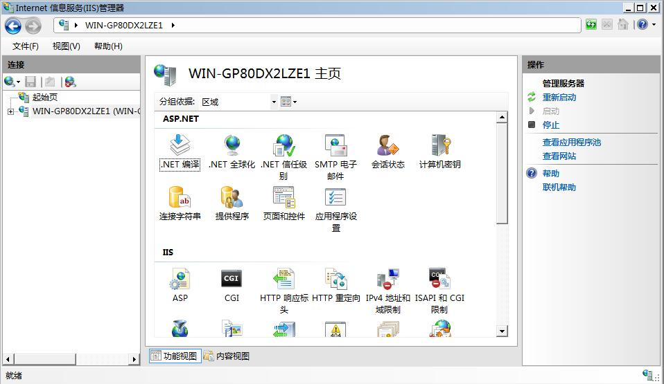
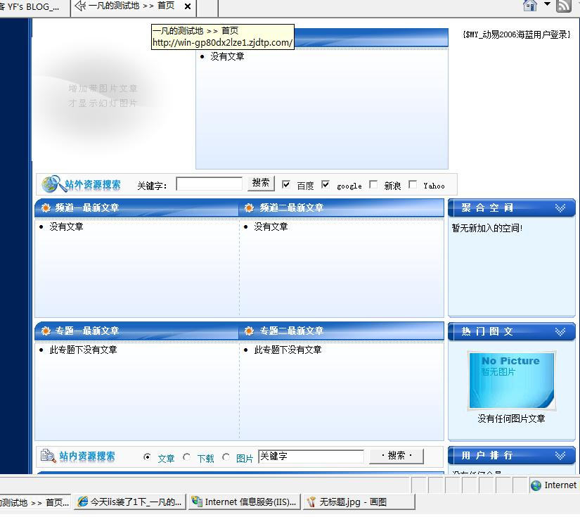

# 事实证明WINDOWS 2008的IIS比VISTA的IIS更好用 

> 2008-01-26

 

  
 

 

  话说昨天我安装了WIN2008,干什么呢?
 

 

  建个服务器玩玩,估计能承受10个人同时在线吧~~~~
 

 

  我试过VISTA的IIS,错误太多,根本无法使用ASP.但是WIN2008就不一样了,安了就能用.
 

 

  <a href="http://hi.baidu.com/yfboke/blog/item/63c49efe2783a5325c6008bf.html">
   http://hi.baidu.com/yfboke/blog/item/63c49efe2783a5325c6008bf.html
  </a>
 

 

  ==================================================================
 

 

  IIS7界面,比IIS6强N多
 

 

  
 

 

  功能强大
 

 

  
 

 

  没有错误,正常配置
 

 

  
 

 

  哈哈~~~~以后学习学习ASP,编几个ASP玩玩也是不错的.
 

 

  ==========================================================
 

 

  小结:建议win2008用户不要使用AERO主题,虽然可以打开,但是感觉比VISTA会更占内存.
 

 

  我这个WIN2008开机占290M-340M内存,IG内存够用了 .开AERO的话占600M-800M内存,虽然不卡,但性能有所下降.要想AERO还是vista为妙.vista开机占400M-500M
 

