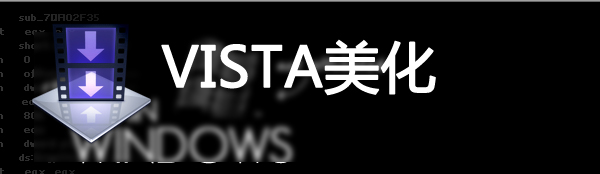
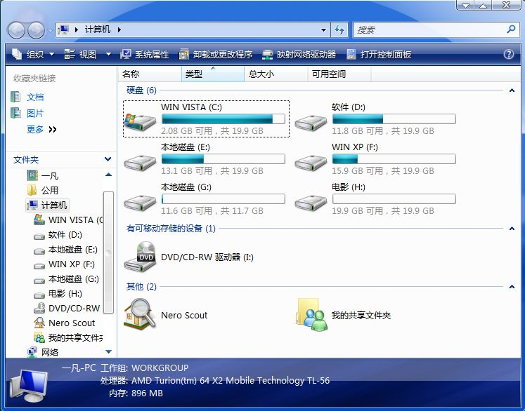

# VISTA照样来个性！ 

> 2008-01-31

 

  
 

 

 

 

  VISTA原版主题玩腻了？1年多了都在用？
 

 

  那就看看我的吧！
 

 

  ....
 

 

  <embed allowscriptaccess="never" height="486" loop="false" menu="false" play="true" pluginspage="http://www.macromedia.com/go/getflashplayer" src="http://www.tudou.com/v/9l98r-bhoEM" style="width: 585px; height: 486px;" type="application/x-shockwave-flash" width="585" wmode="transparent">
  </embed>
 

 

  <strong>
   视频很卡，但是我的计算机不卡，可能是压缩的原因，质量极度缩水，本来录完后生成了890M，经过压缩后变为4.8M。如果不是亲眼所见，99.99%的人都不会相信，再说这仅仅是没有上传之前的。
  </strong>
 

 

  <strong>
   屏幕其实没这么瘦~~~~
  </strong>
 

 

  
 

 

  =================================如何办到呢？=========================
 

 

  大家不妨下载个VISTA优化大师，然后选择其中的VISTA美化大师，先把主题文件破解了，
 

 

  再到
  <a href="http://www.vistaforum.com.cn/category/3/">
   http://www.vistaforum.com.cn/category/3/
  </a>
  下载
 

 

  就能很快的办到了！！！！！！！！！！！！！！！！！！！！！！！！！！！
 

 

  ==========================我不是分割线是什么？=========================
 

