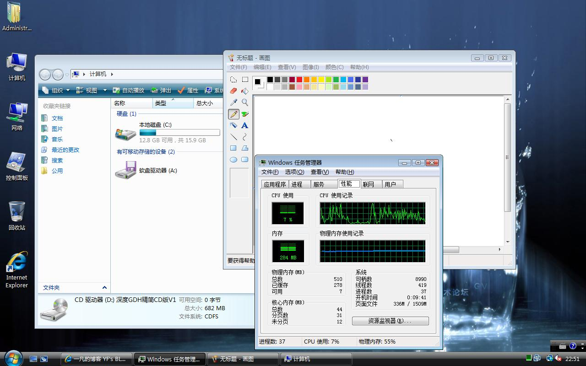

# 深度vista 精简CD版V1 一凡测试评估后的感想 

> 2008-02-01

 

  
 

 

  我想我可能是个系统狂...看到新的系统发布就想试一试。
 

 

  昨天看到远景论坛里XX人转帖了“深度vista 精简CD版V1”
 

 

  我下载下来试试，首先准备了VM虚拟机5.5
 

 

  虚拟机是什么？在一个系统上建立另外一个虚拟的系统的软件。
 

 

  呵呵，不好意思，就一张截图。
 

 

  然后我们开始下载（682M）个人感觉用完后不错
 

 

 

 

  <a href="http://www.5xdown.com/download/soft/soft-107.html" target="_blank">
   下载一 五星软件基地提供
  </a>
   
  <a href="http://www.greendown.cn/soft/9238.html" target="_blank">
   下载二 绿色下载站提供
  </a>
 

 

  下面的过程就是安装啦！！！安装和原VISTA一样，但是速度要快2倍左右，因为毕竟是cd。
 

 

  ok,进入桌面
 

 

 

 

  
 

 

  从图上看，还是不错的，内存才300多M，能流畅运行。
 

 

  但是提醒一下大家：
 

 

  <strong>
   在安装之前一定要准备好各个驱动，否则无法上网，性好我没有安装在机子上，在虚拟机上，虚拟机有个VM软件可以快速安装驱动。
  </strong>
 

 

  这个是个单CD的，比起原来远景论坛里GOUGOUER发布的单CD，貌似好了很多，估计能安装OFFICE，GOUGOUER的连OFFICE都不能安装。但是这个不集成网卡和显卡和一些乱七八糟的驱动。
 

 

  很多附件或者组件都被精简了。毕竟4.5G-700M。
 

 

  另外深度论坛不错，发布的大约都是精品，谁有深度的邀请码？
 

 

  如果有送我一个好吗？我有远景论坛的，大家可以优势互补。
 

