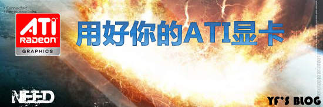
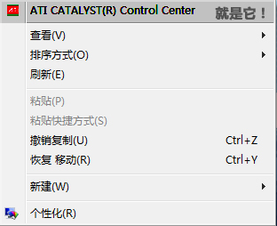
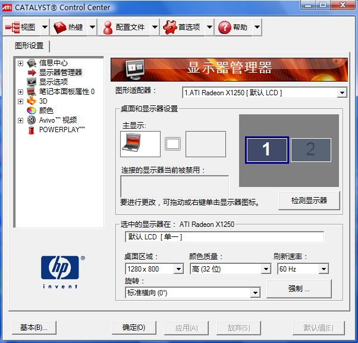
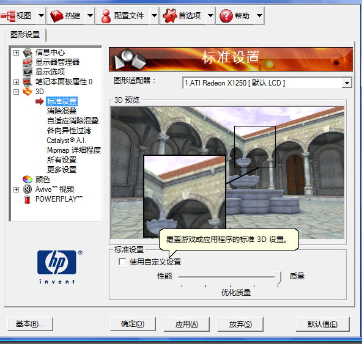
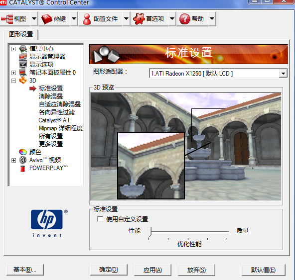

# 用好ATI显卡~该出手时就出手 |游戏运行缓慢怎么办？|游戏人物不清楚怎么办？ 

> 2008-02-02

 

  
 

 

  相信很多人的计算机用的都是ATI显卡吧~ATI个人感觉还不错~~本人也是
 

 

  好了，废话不说，我们开始吧~~~
 

 

  首先 ：
 

 

  桌面-右键-一个有关ATI的名字（不同型号不同的写法这里大家找吧）-进入了ATI控制界面
 

 

  推荐大家高级模式
 

 

  
 

 

  
 

 

  然后
 

 

  请大家选择：
 

 

  <strong>
   1.如果您是游戏玩家，要求更高的游戏质量，请您看我
  </strong>
 

 

  更高的游戏质量？OK没问题！
 

 

  安装如图所示的配置
 

 

  
 

 

 

 

 

 

  其他的如消除混叠什么的也是调到质量，一次类推。这样你的游戏画面会无比的清晰。
 

 

  <strong>
   2.如果您还是游戏玩家，要求更快的游戏速度，请您看我
  </strong>
 

 

  对于某些游戏，游戏的速度决定着他的胜败，是的。如果您觉得过慢。
 

 

  那么老样子
 

 

  
 

 

  一次类推....都是设置为性能位最佳。
 

 

 

 

  <strong>
   3.如果您是办公人士，不玩游戏，请您看我
  </strong>
 

 

  和上面的一样就行了。
 

 

  ========================================================================
 

 

  其实大家还不满足，还可以去下载ATI的超频工具，一般危险不大。
 

 

  优化工具：
  <a href="http://down1.tech.sina.com.cn/download/downContent/2004-06-22/10543.shtml" target="_blank">
   <strong>
    ATI Tray Tools
   </strong>
  </a>
 

 

  超频工具：
  <strong>
   <u>
    <a href="http://www.orsoon.com/Soft/2487.html" target="_blank">
     ATITool (ATI超频工具)V0.26 汉化特别版
    </a>
   </u>
  </strong>
 

 

  ========================================================================
 

 

 

 

 

 一凡原创

