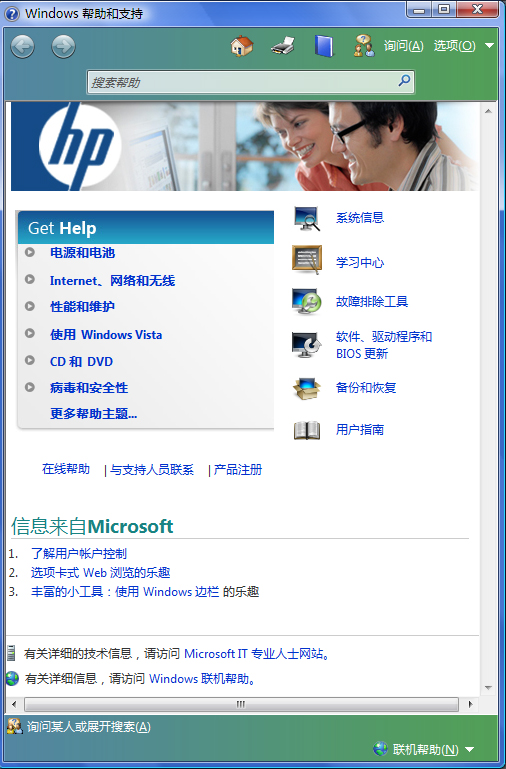
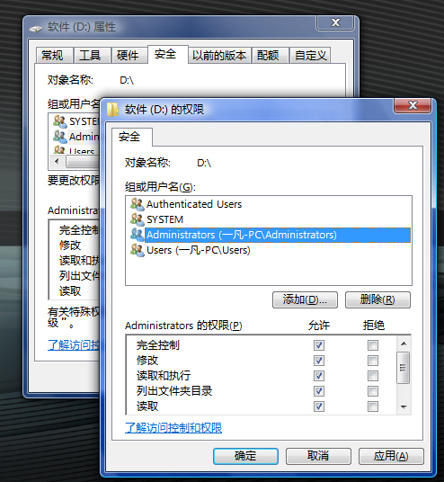
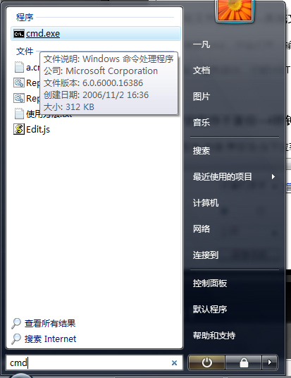
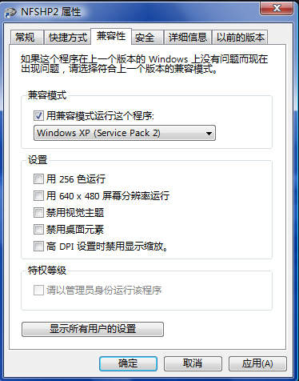
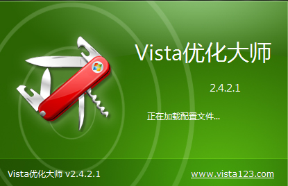
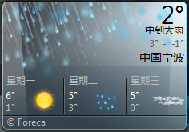
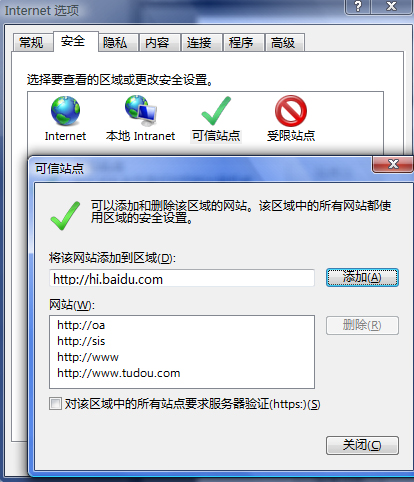

# [迎新春]Vista 使用技巧分享 10个 -BY 一凡|VISTA不会用怎么办？ 

> 2008-02-03

 

  
 

 

  用VISTA也快一年了，对于那些vista新手我给出以下技巧 .供参考 一凡原创！
 

 

  <strong>
   <u>
    1.玩盗版Vista---没问题 Vista 快速激活
   </u>
  </strong>
 

 

  总结了一下，有几下几种激活方法：
 

 

  A.OEM BIOS替换法 ：非常危险，刷BIOS，慎用，但是一旦成功，终身都可以免激活
 

 

  B.OEM模拟法:较为安全，但是SP1会阻止此激活
 

 

  (a):中国人自己的---VISTA LOADER 2.1-
  <a href="http://www.baidu.com/s?ie=gb2312&amp;bs=PNG&amp;sr=&amp;z=&amp;cl=3&amp;f=8&amp;wd=VISTA+LOADER&amp;ct=0" target="_blank">
   百度搜索页面
  </a>
 

 

  (b):外国人的，在国外比较流传，比VISTA LOADER稳定
  <a href="http://ysl668.bokee.com/viewdiary.18120591.html" target="_blank">
   SOFTMOD下载
  </a>
 

 

 

 

  C.激活时间停止法：较为安全，但是SP1会阻止此激活，
  <a href="http://soft.patching.net/list_122.html" target="_blank">
   下载时间停止工具
  </a>
 

 

  D.KMS激活，非常安全，但是仅仅适用于E版和B版：
  <a href="http://vbs.net.cn/DNS/vbs/" target="_blank">
   具体
  </a>
 

 

  总有一款适合你！
 

 

  <strong>
   <u>
    2.您的vista的贴身顾问---WINDOWS 帮助中心
   </u>
  </strong>
 

 

  开始-在搜索框输入：帮助
 

 

  然后打开帮着技术支持：
 

 

  
 

 

  个人感觉，这个VISTA帮助比XP好多了，浅显易懂，而且还有视频教程。
 

 

  <strong>
   <u>
    3.照样玩转NTFS分区---获取NTFS分区下文件夹的权限
   </u>
  </strong>
 

 

  比较难学，大家仔细看。
 

 

  首先找到你要获取权限的文件或文件夹
 

 

  右键-属性-安全-高级-所有者-编辑-然后选中你的用户，点确定。
 

 

  然后关闭，再右键-属性-安全-找到你的用户-编辑-勾上完全控制-然后关闭即可
 

 

  <u>
   
  </u>
 

 

  <strong>
   <u>
    4.系统文件遭破坏---系统文件修复 40秒搞定
   </u>
  </strong>
 

 

  开始-搜索-cmd，然后打开：输入命令：sfc/scannow
 

 

  40秒后，重新启动，你的VISTA会焕然一新
 

 

  
 

 

  <strong>
   <u>
    5.XP的程序不兼容---4秒钟轻松解决
   </u>
  </strong>
 

 

  选择程序-右键-兼容性-在下拉菜单选择WINDWOS XP SP2
 

 

  然后关闭再打开程序即可。
 

 

  
 

 

  <strong>
   <u>
    6.Vista运行速度太慢----轻松优化，一个好汉三个帮
   </u>
  </strong>
 

 

  在这里，我十分的推荐一个软件---
  <a href="http://VISTA123.COM" target="_blank">
   VSITA优化大师
  </a>
 

 

  首次启动会启动其向导，安装人性化的向导，大家自己优化吧~~~
 

 

  
 

 

  <strong>
   <u>
    7.Windows边栏 天气问题---修改文件照样解决
   </u>
  </strong>
 

 

  <a href="http://www.vista123.com/html/233.html" target="_blank">
   参见
  </a>
 

 

  
 

 

  <strong>
   <u>
    8.CD,DVD不会刻录---复制粘贴人性化
   </u>
  </strong>
 

 

  插入空白CD或DVD（你的计算机必须支持刻录），双击光盘，提示让你格式化。
 

 

  你选择第一个格式，第一个 可以在XP下浏览，但是第二个不行。
 

 

  然后光盘格式化，最后把你的文件复制进去就OK啦~不用刻录了，在复制的过程中已经刻录了。
 

 

  这个修复了XP的问题，XP还要再刻录一遍。
 

 

  <strong>
   <u>
    9.想要XP又想要VISTA---没问题！两下搞定！
   </u>
  </strong>
 

 

  1.如果安装XP-vista的话没有问题
 

 

  2.如果是VISTA-XP，请看我，BOIS启动下-插入VISTA光盘-安装windows-修复计算机-自动检查修复错误（好像是这个，反正就是第一个），点一下，等一下提示你重启就会看到VISTA啦，然后进入VISTA，下载widnwos优化的大师，然后添加XP的位置即可。
 

 

  <strong>
   <u>
    10.网站有控件，不能安装---几下设置就行了~
   </u>
  </strong>
 

 

  IE-工具-internet设置-安全-可信网站-添加-（把那个什么HTTPS勾掉），然后写上有控件的网站，确定，确定。前提是你必须信任这个网站不会给你带来病毒和危险。
 

 

  
 

 

  呵呵这就是我送给新手的技巧，高手不用看啦~送给百度GOOGLE的人
 

