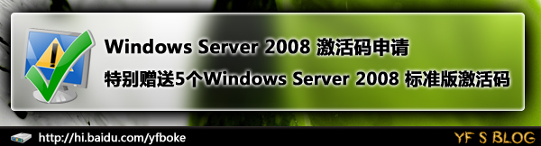
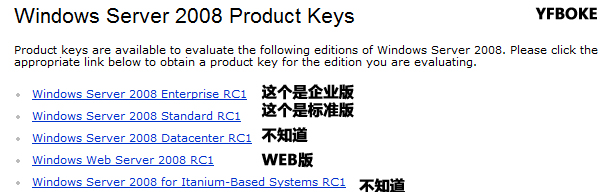

# Windows server 2008 激活码申请指南|特别赠送5个激活码|BY一凡（已经过期） 

> 2008-02-04

 

  
 

 

  <strong>
   本方法已经过期
  </strong>
 

 

  首先，为了庆祝访问量超过了11123，所以答谢广大HI友，特别赠送Windows Server 2008标准版（RCO或RC1）的激活码
 

 Product key 1: KKGJR-HXJQ8-4RM4Y-D686W-VKDHG
  
 Product key 2: YMT32-FPMJB-DFKG6-MRF77-DJW9K
  
 Product key 3: PPBQP-WHCKC-7TJ7D-XH9D2-G3K7V
  
 Product key 4: Q43G8-TB3JF-Q49XW-CKF3P-Q2TC2
  
 Product key 5: KC4K2-QWD26-FYCFJ-HDPMM-JRPWR
 

  如果上面不行，大家可以自己申请：
 

 

  访问这个页面：
  <a href="http://technet.microsoft.com/zh-cn/bb687945(en-us).aspx">
   http://technet.microsoft.com/zh-cn/bb687945(en-us).aspx
  </a>
 

 

  打开后，找到
  <strong>
   Don’t Have a Product Key? Register for Optimal Evaluation Experience
  </strong>
  栏目
 

 

  选择English(US)，然后点&gt;
 

 

  然后登陆您的LIVE（MSN）帐号，没有的话，到MSN.COM申请
 

 

  然后选择您的版本，填写一些详细信息，可以乱填。
 

 

  
 

 

  我选择标准版
 

 

  点这个
  <strong>
   Get an Additional Product Key
  </strong>
   
  (Maximum: 5)
 

 

  然后就可以看到了，一个可以用5次
 

 

  大家有兴趣的话可以试试
 

