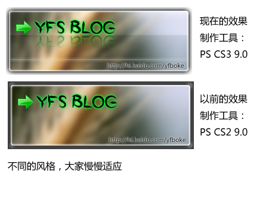

# PS作了个本站的图，貌似更细腻了 

> 2008-02-05

 

  
 

 

  
 

 

  这个就是现在的效果，大概以后就用这种效果了...个人感觉更细腻了...
 

 

  为什么这样说呢？首先它是PNG图，透明的。
 

 

  咱们不妨比较一下以前的做的PS图
 

 

  PS技术一天一天的提高吧~~~
 

 

  大家说呢？是第一个好，还是第二个好呢？
 

 

  大家慢慢适应，主要是比以前的效果增加了：
 

 

  +文字倒影
 

 

  +曲线调节
 

 

  +光亮虚线
 

 

  +颜色渐变
 

 

  
 

 

  感谢以下朋友提高我的PS技术：lzlhoho，梦梦（虽然没有教程，但是看了他的个性的logo图，启发了我的创意）
 

