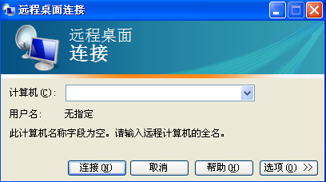

# XP SP3后续功能 

> 2008-02-08

 

  
 

 

  SP3，界面没有什么变化
 

 

  就是远程控制变成了VISTA版的了，为什么呢？
 

 

  这是为什么呢？
 

 

  呵呵，最新流行词
 

 

  我认为是因为：           Vista的远程控制，可以不见到对方的系统界面就直接登陆。免去当年WIN2000的超级大漏洞！！！
 

 

  
 

 

  另外系统版本也变了~~~sp3~~~不用截图了
 

