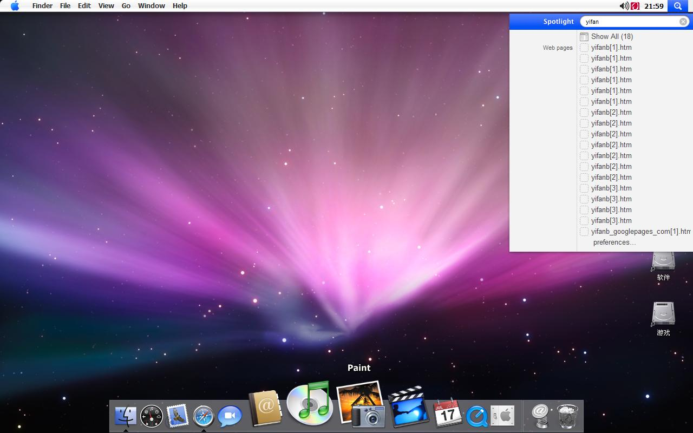
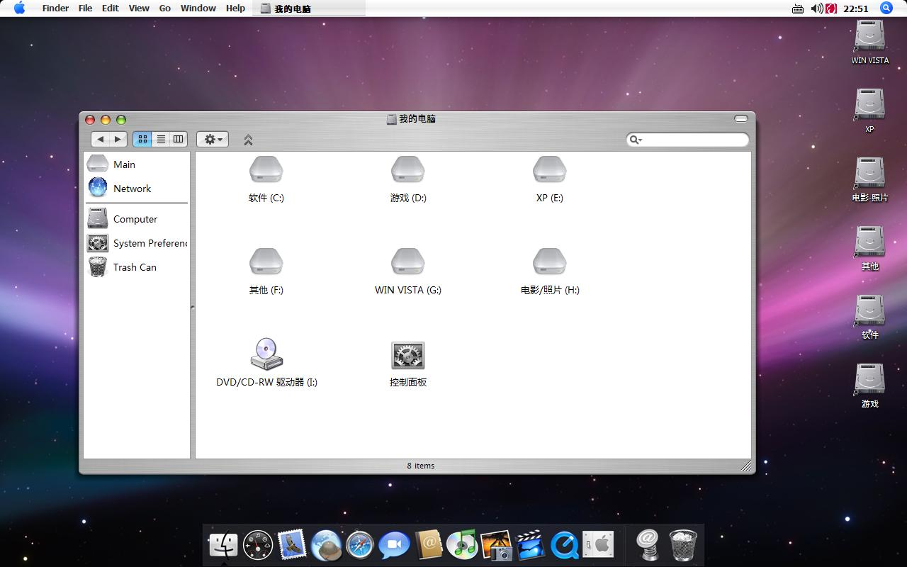
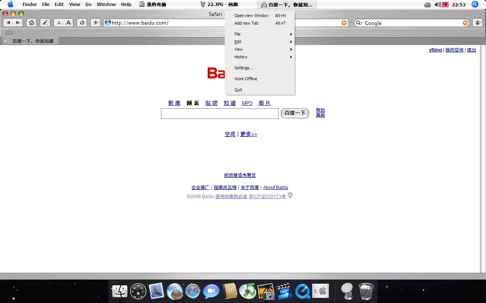

# 大家说苹果系统是什么样子？ 

> 2008-02-09

 

  
 

 

  今天去外面逛了逛，竟然发现有卖imac,ipod,iphone的，价格都挺高，最便宜的是:ipod--2000多块，还没有屏幕，我穷人，就是看了看，回家就不行了，估计我的系统狂那个病又发作了。。。。
 

 

  回家就模拟了一下，环境：xp sp3
 

 

  由于SP3十分的限制文件，主题破解花了半天工夫（早知道我不升级了）。
 

 

  大家看看吧，内存占用：400M/890M
 

 

  汗！不卡，因为内存1G，分给显寸256M
 

 

 

 

  
 

 

  图画质量不太好，1280*800，建议放大
 

 

 

 

  
 

 

  还可以模拟，再模拟的话，还不如直接安装MAC算了~~~
 

 

 

 

  
 

 

  字体：苹果系统的字体，感觉和雅黑差不多
 

 

 

 

  
 

 

 

