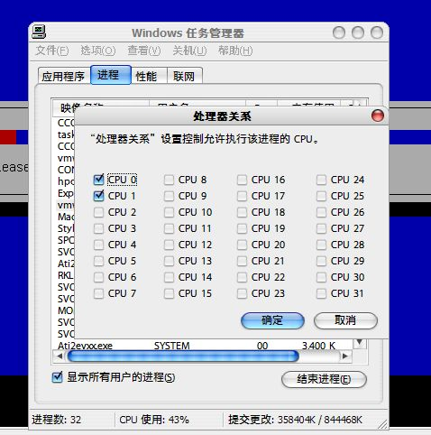

# 我家的CPU高级！！！ 

> 2008-02-11

 

  
 

 

   
  今天我用虚拟机玩系统时，想减去一个CPU，在Vista 下，是有多少个CPU显示多少个，可是...XP里确是...太厉害了！
 

 

  您见过31个CPU的处理器吗？
  <strong>
   这是XP SP3的另外的一个功能吗？
  </strong>
 

 

  <strong>
    
   
  </strong>
 

