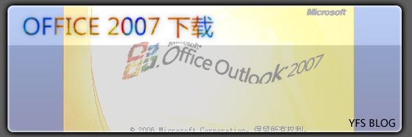
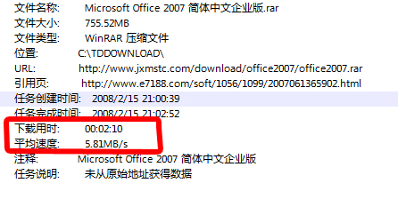
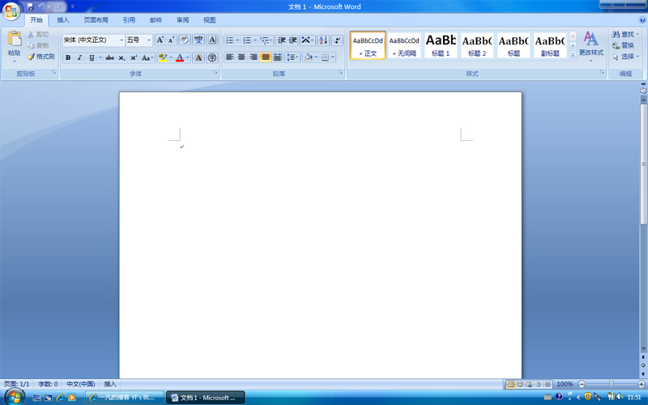
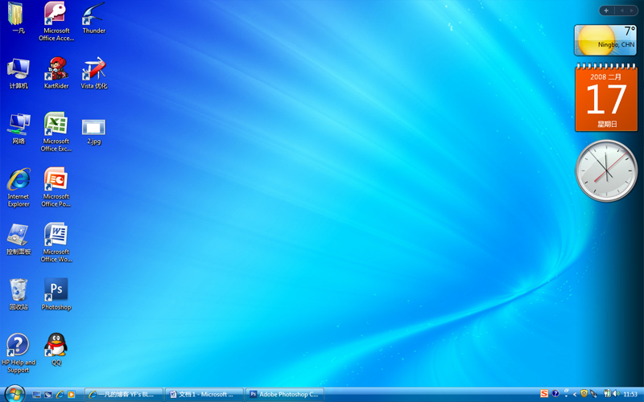
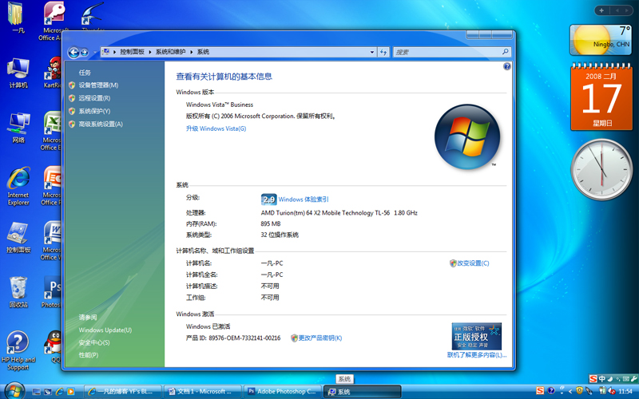

# Office2007 下载 

> 2008-02-16

 

 

 

 

 

 

 

  
 

 

  OFFICE2007
 

 

  在此下载：
  <a href="http://www.jxmstc.com/download/office2007/office2007.rar">
   http://www.jxmstc.com/download/office2007/office2007.rar
  </a>
  （迅雷下载）
 

 

  微软office2007为微软最新的office系列软件,不仅在功能上进行了优化,而且安全性稳定性更得到了巩固.现在终于有了简体中文版的office2007软件来供下载了. PRO:专业版
 

 

  Microsoft Office Professional Plus 2007 (New!) 包括：
   
  •Microsoft Office Excel 2007
   
  •Microsoft Office Outlook 2007
   
  •Microsoft Office PowerPoint 2007
   
  •Microsoft Office Word 2007
   
  •Microsoft Office Access 2007
   
  •Microsoft Office InfoPath 2007
   
  •Microsoft Office Communicator
   
  •Microsoft Office Publisher 2007
   
  •集成的解决方案能力，比如企业内容管理（ECM），电子表单以及信息权限及策略管理能力。
 

 

  提示：下载后为.iso格式，可以用虚拟光驱载入进行安装！或者刻录光盘，安装序列号：DBXYD-TF477-46YM4-W74MH-6YDQ8
 

 

  下载速度如图
 

 

  
 

 

  （我家网速快！光纤，大家可能没有这么快，vista系统（4.7G）7-14分下载好）
 

 

  秀秀office
 

 

  
 

 

  说说最近状况吧~~~~
 

 

  重新安装了vista，为什么呢？（因为我是系统狂）
 

 

  先是帮网友（延桦）制作模板，刚刚制作一般，明天完成全部，然后帮一个网友（Eιǒνīｄ）安装vista。
 

 

  我不光光帮别人，经网友（lzlhoho,延桦）推荐，我晚上了跑跑卡丁车/玩得也很垃圾。这个游戏不错！我也推荐一下
 

 

  闲的时候上上远景论坛，讨点东西，或者上上QQ，在Vista┆SP1交流1群吵一吵，呵呵！！！
 

 

  这个Office2007就是群友（XXX忘了）推荐的哦~~~~感谢他们
 

 

  PackVista.cn也没时间管了。
 

 

  最后，一定要请好友注意，写BLOG一定要保存一下，刚才死机，白写了，20分钟啊~~~~
 

 

  最后秀秀我的vsita吧~~~~
 

 

  
 

 

  蓝色主题，蓝色为主，橙色为辅。搭配起来，相当漂亮。
 

 

  
 

 

  成功激活
 

