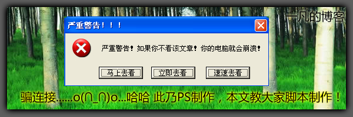
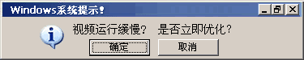
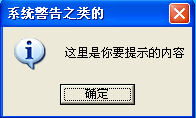

# 广告满天飞...欺骗用户...顺便教个如何制作 

> 2008-02-23

 

 

 

  
 

 

  现在出广告的人真是太绝了~~~~
 

 

  有很多人问我,它的电脑系统提示：您的系统运行缓慢，请立即安装XXX。
 

 

  我汗！他真给把它当真了，结果安装后，杀毒报毒，问我这是怎么回事。我很汗！！！
 

 

  我说那个仅仅是个图片...不是系统提示的脚本...........
 

 

  我平时收集了几个比较经典的这类的广告.............
 

 

  骗连接..............太多了，很多菜鸟防不胜防。
 

 

  这类连接的出现是从...大概2005年开始有的，我见到的最经典的是火狐的，提示一个类似IE的控件的...提示要更换浏览器。
 

 

  不过找不到代码了...大家看看下面的。
 

 

  
 

 

  这个是个像Windwos 9X和XP的WINDOWS准窗口的提示框的图片......
 

 

  一般菜鸟的上当率很高的..........
 

 

  
 

 

  这个更经典了...........
 

 

  利用人们的贪小便宜的心里，其实QQ有什么好的，什么都抄袭...
 

 

  QB是个垃圾东西....再说这个肯定不是真的，你想真的有天上掉馅饼事？那这个发馅饼的人是傻子！
 

 

  
 

 

  再说一下，很多人都点X，来关闭它，有的广告可以，但是大多数都是不行，都是骗连接........
 

 

  很多人都是点击了X，给他们送钱去了........
 

 

  <strong>
   再说一下：
  </strong>
 

 

  呵呵，这种广告制作方法很简单啊.....
 

 

  PS的做法我就不说了...交给大家一个最简单的方法
 

 

  在任意文件夹里，新建一个文本，把它的扩展名改为VBS（就是VB格式的脚本文件，类似JS，不够JS我不会编，很不精通，VB会一点）
 

 

  然后右键，编辑，进入了记事本里。然后输入：
 

 

  MsgBox "这里是你要提示的内容", vbInformation, "系统警告之类的"
 

 

  然后根据中文替换....然后保存，最后运行。将会出现提示，你用QQ解一下图就行了。
 

 

  以上仅仅是提示框类的。
 

 

  
 

 

  vbInformation也可以替换很多，如：
 

 

  vbOKOnly                  0 只显示“确定”按钮
   
  VbOKCancel             1 显示“确定”和“取消”按钮
   
  VbAbortRetryIgnore 2 显示“终止”、“重试”和“忽略” 按钮
   
  VbYesNoCancel         3 显示“是”、“否”和“取消”按钮
   
  VbYesNo                 4 显示“是”和“否”按钮
   
  VbRetryCancel         5 显示“重试”和“取消”按钮
   
  VbCritical             16 显示“关键信息”图标
   
  VbQuestion             32 显示“警告询问”图标
   
  VbExclamation         48 显示“警告消息”图标
   
  VbInformation         64 显示“通知消息”图标
   
  vbDefaultButton1     0 第一个按钮是缺省值(缺省设置)
   
  vbDefaultButton2     256第二个按钮是缺省值
   
  vbDefaultButton3     512第三个按钮是缺省值
   
  vbDefaultButton4     768第四个按钮是缺省值
   
  vbApplicationModal     0应用程序强制返回；应用程序一直被挂起，直到用户对消息框
   
  作出响应才继续工作
   
  vbSystemModal         4096系统强制返回；全部应用程序都被挂起，直到用户对消息框作
   
  出响应才继续工作
   
  vbMsgBoxHelpButton      16384将Help按钮添加到消息框
   
  VbMsgBoxSetForeground 65536指定消息框窗口作为前景窗口
   
  vbMsgBoxRight         524288文本为右对齐
   
  vbMsgBoxRtlReading 1048576指定文本应为在希伯来和阿拉伯语系统中的从右到左显示
   
  呵呵............
 

 

  制作这种广告很简单，但是欺骗了很多用户/!#
 

 

  这就是可能你莫名其妙的中了病毒的原因。
 

 

  欢迎大家在下面提供各类经典广告的素材....本文会不断更新
 

