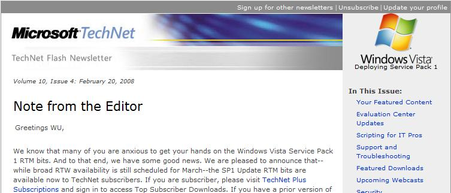

# 来自微软给我发的一封有关Vista SP1的邮件 

> 2008-02-24

 

 

 

  
 

 

  下面是截图
 

 

  邮件标题：怎样获得VISTA SP1？（本来是英文的...是这个意思）
 

 

  以前也受过N个这样的邮件，以为是广告，其实不是..........
 

 

  微软太专业了，可能是批量发的...........
 

 

  TEACHNET是不是有些优惠？
 

 

  不知道..........什么时候点的加入TEACHNET！反正我是其中的一个成员吧
 

 

  
 

 

  部分截图
 

 

  （来自微软的任何邮件都类似于网页，不要误会！！！）
 

 

 

 

  全文：
 

 

  Note from the Editor                                                                             Greetings WU,
 

 We know that many of you are anxious to get your hands on the Windows Vista Service Pack 1 RTM bits. And to that end, we have some good news. We are pleased to announce that--while broad RTW availability is still scheduled for March--the SP1 Update RTM bits are available now to TechNet subscribers. If you are subscriber, please visit
 <a href="http://go.microsoft.com/?linkid=8345227" target="_blank">
  TechNet Plus Subscriptions
 </a>
 and sign in to access Top Subscriber Downloads. If you have a prior version of the SP1 beta installed, you must uninstall it prior to installing the final version. Check out
 <a href="http://go.microsoft.com/?linkid=8345228" target="_blank">
  Things to know before you download Windows Vista SP1
 </a>
 for more information, and for updated details on all aspects of Windows Vista SP1, stop by the
 <a href="http://go.microsoft.com/?linkid=8345229" target="_blank">
  Windows Vista TechCenter
 </a>
 .
  
  
 For a closer look
 <a href="http://go.microsoft.com/?linkid=8345230" target="_blank">
  Inside Vista SP1 File Copy Improvements
 </a>
 pull up Mark Russinovich's (of Sysinternals fame) blog and learn about the evolution of the file copy. Also catch Mark and a panel of experts on March 5 at 9:00 AM Pacific Time for a live, interactive discussion on adopting Windows Vista into a desktop infrastructure. Sign up for
 <a href="http://go.microsoft.com/?linkid=8345231" target="_blank">
  Still Undecided on Windows Vista?
 </a>
 and hear about the challenges, workarounds, and tips &amp; tricks they have learned along the way. For access to guidance, resources, tools, and straight-talk articles today, visit the
 <a href="http://go.microsoft.com/?linkid=8345232" target="_blank">
  Springboard Series
 </a>
 for Windows Vista.
  
  
 Also from the Sysinternals crew, you'll definitely want to grab the update of Sigcheck, a command-line file version display and signature checking utility.
 <a href="http://go.microsoft.com/?linkid=8345233" target="_blank">
  Sigcheck v1.50
 </a>
 adds a new option for displaying file hashes.
  
  
 <strong>
  Windows XP Service Pack 3, Release Candidate 2
 </strong>
  
 Available now, the very latest build of SP3 for Windows XP includes all previously released updates for the operating system, similar to previous service packs. It also includes previously released updates to the latest versions of some system components, as well as functionality for improved compatibility with Windows Vista. The application to enable the XP SP3 RC2 download can be found at the
 <a href="http://go.microsoft.com/?linkid=8345234" target="_blank">
  Microsoft Download Center
 </a>
 . Running this application on a machine with Windows XP Service Pack 2 will enable Windows Update to offer XP SP3 RC2 to that machine. Build-to-build upgrades are not supported for this beta release, so if you have installed XP SP3 RC1, please uninstall it before running this application. More information regarding XP SP3 can be found on the
 <a href="http://go.microsoft.com/?linkid=8345235" target="_blank">
  Windows XP TechCenter
 </a>
 .
  
  
 Finally, the 2007 Microsoft Office system includes design changes you should know about before you deploy or upgrade from previous versions in your Terminal Services server farm. Check out
 <a href="http://go.microsoft.com/?linkid=8345236" target="_blank">
  TechNet Magazine's Online Extra
 </a>
 before you deploy the 2007 Office system with Terminal Services.
  
  
 Thanks for reading,
  
  
 Mitch Irsfeld
  
 Editor,
 <em>
  TechNet Flash
 </em>
 

 

 

  =======================================================================
 

 

  虽然很多都没有看懂，大概意思知道了.........告诉我一个好消息，VISTA SP1和XP SP3可以在下载中心找到..........
 

 

  但是不知道何时我加入了微软的TEACHNET，几乎每个月给我发一封这类的邮件.
 

 

  大家有没有接到过？我接到这个还是很兴奋的。
 

 

  =======================================================================
 

