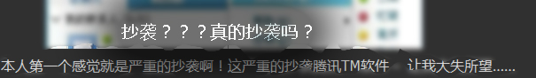

# BaiDu要出IM聊天软件了.大家怎么看？ 

> 2008-02-29

 

  <strong>
   
  </strong>
 

 

  <strong>
   B
  </strong>
  ai
  <strong>
   D
  </strong>
  u要出IM，大家知道吗？
 

 

  我试了一下，大家不要下载。
 

 

  不能登陆，似乎只能在百度的办公室里能用。
 

 

  一看我看着也有点像QQ，这是真的。
 

 

  但是，我看到了如此的一段话：
 

 

  （这篇文章是TX推荐的，发布在新闻里的。说明TX同意他的意见）
 

 

  我认为不然，如果这么说。
 

 

  
 

 

  中国人用QQ多，但是外国人用MSN多。
 

 

  所以很多人以为是抄QQ,其实MSN和百度HI,GMAIL,新浪UC几乎都是抄袭MSN的。
 

 

  我给大家看看IM的抄袭状况
 

 

  MSN-&gt;?不知道那个IM
 

 

  QQ(ICOQ)-&gt;MSN
 

 

  网易泡泡-&gt;QQ
 

 

  新浪UC-&gt;网易泡泡
 

 

  百度HI-&gt;TX TM或QQ 2008
 

 

  ..............随便他了，TX也不要生气，谁叫你最爱抄呢？？？人家抄袭你的，让你体验一下被抄的滋味~
 

 

  还有一个问题，那就是...
 

 

  <embed allowscriptaccess="never" height="429" loop="false" menu="false" play="true" pluginspage="http://www.macromedia.com/go/getflashplayer" src="http://www.tudou.com/v/82xlixc5EKk" style="width: 574px; height: 429px;" type="application/x-shockwave-flash" width="574" wmode="transparent">
  </embed>
 

 

  他们忘记改名字了......
 

 

  呵呵，总之。我们期待百度HI吧~~~~
 

 

  （录像本来很清晰--120M，一上传，就傻了...........）
 

 

  下面是截图....
 

 

  
 

 

  比较新颖哦~~~~
 

 

  
 

 

  此乃类似QQ
 

 

  
 

 

  咱们刚才看到过的。
 

 

  
 

 

  类似QQ
 

 

 

 

  
 

 

  另外窗口.....
 

 

 

 

  
 

 

  比较简洁....HIbaidu！！！
 

 

  期待ing...........
 

 

  <strong>
   下载百度Hi 1.0 Beta1
    
   
   太平洋下载:
  </strong>
   
  
  <strong>
   中关村下载:
  </strong>
  <a href="http://xiazai.zol.com.cn/detail/20/197649.shtml" target="_blank">
   BaiduHi 1.0 Beta1 下载
  </a>
 

 

  李彦宏的看法：
 

 

  <a href="http://hi.baidu.com/liyanhong/blog/item/c240ad4bed4cdbf482025c02.html">
   http://hi.baidu.com/liyanhong/blog/item/c240ad4bed4cdbf482025c02.html
  </a>
 

 

  <strong>
   大家说呢？
  </strong>
 

 

 

