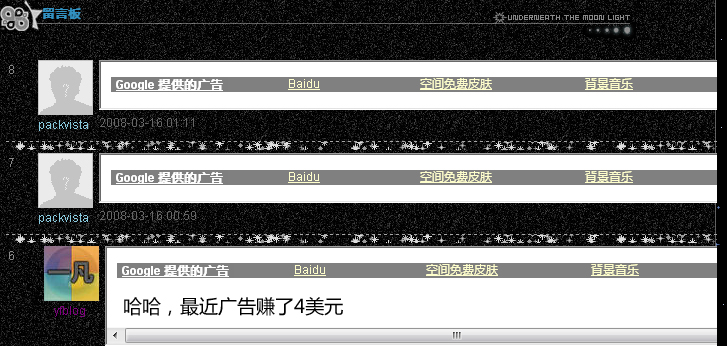

# 百度漏洞出现~漏洞太低级了 

> 2008-03-16

 

 

 

  
 

 

  <strong>
   该方法已失效！举报后经核实已经打上了该漏洞的补丁了！
  </strong>
 

 

  前两天我发现了留言板的html漏洞，就是没分享，结果过了两天N多人知道了............
 

 

  看来空间可以用来挂马了。
 

 

  <u>
   猪头jun
  </u>
  已经投诉，
  <a href="http://tieba.baidu.com/f?kz=340085156">
   http://tieba.baidu.com/f?kz=340085156
  </a>
 

 

  <u>
   qq853208650
  </u>
  也投诉了，
  <a href="http://tieba.baidu.com/f?kz=340036573">
   http://tieba.baidu.com/f?kz=340036573
  </a>
 

 

  这个是交友型的漏洞。因为交友型的模板会引用3个CSS.博客型的是2个CSS。明显不同。
 

 

  第3个CSS不会被DUDU过滤，所以漏洞出现！
 

 

  有人用漏洞挂马，有人用漏洞跳转，我呢？用来发广告赚钱吧~
 

 

  <a href="http://hi.baidu.com/packvista">
   http://hi.baidu.com/packvista
  </a>
  我挂的广告，大家可以看一下
 

 

  
 

 

  其实该漏洞代码很简单。大家可以看一下
 

 

  一定要在交友型的留言板里留言即可......
 

 

  &lt;/frame src="
  <a href="http://hihc.xicp.net/yf/a.html">
   http://hihc.xicp.net/yf/a.html
  </a>
  " width="900" height="50"&gt;&lt;/iframe&gt;
 

 

  就是一个简简单单的框架代码罢了，但是百度这次太笨了..........
 

 

  大家有兴趣可以试一试，但是千万不要过分哦~~~~
 

 

  不知道其他的html可以不，比如JS什么的，反正框架式肯定可以，必须在交友型里才行~~~~~~
 

 

  如果DUDU过来，不要F我哦~~~~~~~~~~~我是好心提醒。
 

