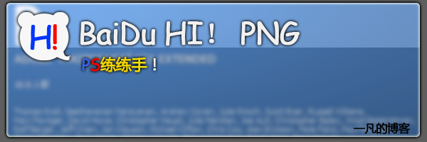

# [PS]Baidu HI的图标的PNG，非提取...PS原装制作！ 

> 2008-03-28

 

  
 

 

  非提取版，因为提取版就没意思了...练练手
 

 

  制作工具：PS，制作时间：10分钟（4分钟完成，6分钟改进..）
 

 

  制作者：一凡
 

 

  制作时间：2008年3月28日
 

 

  （你的废话怎么那么多....）
 

 

  PNG在下面~~~~~~~~~~~~~~~
 

 

  感觉如何呢？大家如果需要PNG可以随便拿去用.....右键-另存为-注意，格式一定要PNG！
 

 

  
 

 

  [HIPNG1，非立体效果...]
 

 

 

 

  
 

 

  [HIPNG2，有点立体效果...但不像！技术有限]
 

 

  PSD在哪里下呢？
 

 

  可以向我要HI...我会给的
 

 

  只要我有时间
 

 

  
 

 

  设计中...
 

 

  感谢Eliop和purezhi 的建议............
 

 

  PS高手见笑了
 

 

  另外：HI已经公测了...我的ID：yfblog
 

 

  我快被HI死了...每天有3页多的百度HI的系统消息提示....
   
  公测了也许会好点
 

 

  
 

